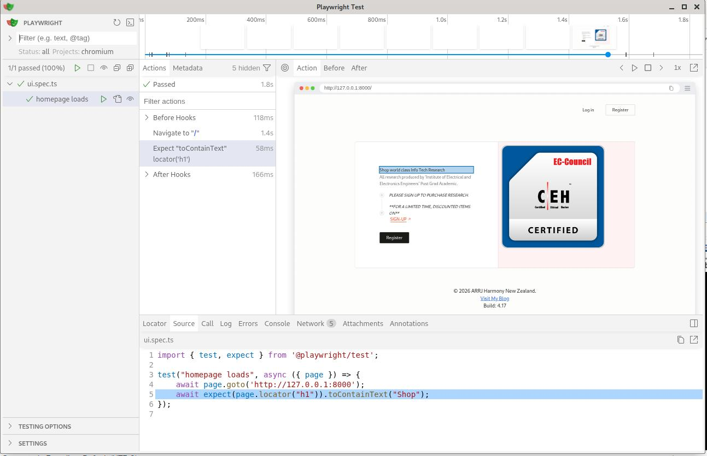

---

#Laravel + Breeze + MySQL + CMS + Recaptcha2 + PHP Unit + Playwright + Cucumber (BDD) Automation Framework

## 1.0 Summary

A complete end‑to‑end automation framework combining:

a. Laravel frontend, backend and api

b. Playwright UI testing

c. Playwright API testing

d. Playwright visual regression

e. Cucumber BDD with TypeScript

f. GitHub Actions CI pipeline

g. HTML reporting

This commercial project demonstrates a modern, production‑grade automation stack suitable for enterprise QA engineering.


## 2.0 Features
### 2.1 UI Automation (Playwright)

i.	Login flow

ii.	Dashboard navigation

iii.	Form interactions

iv.	Assertions and URL checks

v. API Automation

vi.	Tests Laravel API endpoints

vii.	Validates JSON structure

viii.	Status code checks

ix.	Schema validation ready

x. Visual Regression Testing

xi.	Pixel perfect homepage snapshot

xii.	Automatic baseline management

xiii.	Snapshot diffing

xiv. BDD with Cucumber

xv.	Gherkin feature files

xvi.	Step definitions in TypeScript

xvii.	Playwright browser automation inside steps

### 2.2 CI/CD with GitHub Actions

i. Installs dependencies

ii.	Installs Playwright browsers

iii.	Runs UI/API/visual tests

iv.	Runs Cucumber tests

v.	Uploads HTML report as artifact
 
 
### 2.3 Running Tests

#### 2.3.1 UI/API/Visual tests:

i. npx playwright test --reporter=html
ii. npx playwright show-report
iii. BDD tests:
iv. npm run test:bdd

#### 2.3.2 PHP Unit and feature tests

Running 'npm run dev' or 'npm run build' already runs them. Check:

i. test-output.txt
ii. report.html

### 2.4 Requirements
i. 	Node.js 18+
ii.	PHP 8+
iii.	Laravel 10/11
iv.	Playwright
v.	Cucumber.js
 
### 2.5 CI Pipeline
GitHub Actions workflow runs:
i.	Playwright tests
ii.	Cucumber tests
iii.	Uploads HTML report
See .github/workflows/playwright.yml.


## 3.0 Project Structure

```
blog-systematicdefence-tech/
│
├── app/
│   ├── Models/Comment.php
│   └── Http/Controllers/CommentController.php
│
├── public/
│   ├── images/
│   ├── audio/
│   ├── css/
│   └── js/
│
├── resources/
│   ├── views/
│   │   ├── resilience.blade.php
│   │   ├── professionalism.blade.php
│   │   ├── leadership.blade.php
│   │   ├── ethics.blade.php
│   │   └── components/comments.blade.php
│
├── routes/
│   └── web.php
│   └── api.php
└── .env
│
├──Tests
│   └── TestCase.php
│   ├── Unit/
│   |   └── ExampleTest.php
│   ├── Feature/
│       ├── ExampleTest.php
│       └── ProfileTest.php
│       └──Auth/
│           ├── AuthenticationTest.php
│           ├── EmailVerificationTest.php
│           ├── PasswordConfirmationTest.php
│           ├── PasswordResetTest.php
│           ├── PasswordUpdateTest.php
│           └── RegisterationTest.php
├──laravel-playwright-poc/
   │
   ├── features/
   │   ├── login.feature
   │   └── step_definitions/
   │       └── login.steps.ts
   │
   ├── tests/
   │   ├── api.spec.ts
   │   ├── login.spec.ts
   │   └── visual.spec.ts
   │
   ├── .github/workflows/playwright.yml
   ├── cucumber.js
   ├── package.json
   ├── tsconfig.json
   └── playwright.config.ts
```

# 4.0 Setup

Pre-Req : Install XAMPP/ LAMPP for your PC's OS

1. Terminal #1 (Assuming Linux)

```
sudo /opt/lampp/manager-linux-x64.run
```
Start MySQL and Apache Servers

2. Terminal #2

```
cd webstore-jay
php artisan migrate:fresh --seed
php artisan serve

```

# 5.0 Versions


## 1.00

Thu 8 July 07:47 HOURS: 

Branch initialised for testing from "branch fastcomet's Kali Linux version 4.17 - Sun Jun 14 02:42:30 2026 +1200".

## 1.01

Thu 8 July 08:30 HOURS: 

Added Section 4.0 Setup.

## 1.02

Thu 8 July 10:23 HOURS: 

Added laravel-playwright-poc/tests/basics.ts.

## 1.03


Thu 8 July 10:43 HOURS: 

First test passes in ui.spec.ts. Test run via command 'npx playwright test ui.spec.ts --ui':

