---

#Laravel + Breeze + MySQL + CMS + Recaptcha2 + PHP Unit + Playwright + Cucumber (BDD) Automation Framework

A complete end‑to‑end automation framework combining:

a. Laravel frontend, backend and api

b. Playwright UI testing

c. Playwright API testing

d. Playwright visual regression

e. Cucumber BDD with TypeScript

f. GitHub Actions CI pipeline

g. HTML reporting

This commercial project demonstrates a modern, production‑grade automation stack suitable for enterprise QA engineering.


## Features
a. UI Automation (Playwright)

i.	Login flow

ii.	Dashboard navigation

iii.	Form interactions

iv.	Assertions and URL checks

v. API Automation

vi.	Tests Laravel API endpoints

vii.	Validates JSON structure

viii.	Status code checks

ix.	Schema validation ready

x. Visual Regression Testing

xi.	Pixel perfect homepage snapshot

xii.	Automatic baseline management

xiii.	Snapshot diffing

xiv. BDD with Cucumber

xv.	Gherkin feature files

xvi.	Step definitions in TypeScript

xvii.	Playwright browser automation inside steps

b. CI/CD with GitHub Actions

i. Installs dependencies

ii.	Installs Playwright browsers

iii.	Runs UI/API/visual tests

iv.	Runs Cucumber tests

v.	Uploads HTML report as artifact
 
 
c. Running Tests

c.1 UI/API/Visual tests:

i. npx playwright test --reporter=html
ii. npx playwright show-report
iii. BDD tests:
iv. npm run test:bdd

c.2 PHP Unit and feature tests

Running 'npm run dev' or 'npm run build' already runs them. Check:

i. test-output.txt
ii. report.html

d. Requirements
i. 	Node.js 18+
ii.	PHP 8+
iii.	Laravel 10/11
iv.	Playwright
v.	Cucumber.js
 
e. CI Pipeline
GitHub Actions workflow runs:
i.	Playwright tests
ii.	Cucumber tests
iii.	Uploads HTML report
See .github/workflows/playwright.yml.


## Planned Project High Level Structure

```
blog-systematicdefence-tech/
│
├── app/
│   ├── Models/Comment.php
│   └── Http/Controllers/CommentController.php
│
├── public/
│   ├── images/
│   ├── audio/
│   ├── css/
│   └── js/
│
├── resources/
│   ├── views/
│   │   ├── resilience.blade.php
│   │   ├── professionalism.blade.php
│   │   ├── leadership.blade.php
│   │   ├── ethics.blade.php
│   │   └── components/comments.blade.php
│
├── routes/
│   └── web.php
│   └── api.php
└── .env
│
├──Tests
│   └── TestCase.php
│   ├── Unit/
│   |   └── ExampleTest.php
│   ├── Feature/
│       ├── ExampleTest.php
│       └── ProfileTest.php
│       └──Auth/
│           ├── AuthenticationTest.php
│           ├── EmailVerificationTest.php
│           ├── PasswordConfirmationTest.php
│           ├── PasswordResetTest.php
│           ├── PasswordUpdateTest.php
│           └── RegisterationTest.php
├──laravel-playwright-poc/
   │
   ├── features/
   │   ├── login.feature
   │   └── step_definitions/
   │       └── login.steps.ts
   │
   ├── tests/
   │   ├── api.spec.ts
   │   ├── login.spec.ts
   │   └── visual.spec.ts
   │
   ├── .github/workflows/playwright.yml
   ├── cucumber.js
   ├── package.json
   ├── tsconfig.json
   └── playwright.config.ts
```


# Versions

### 0.1 
2 May 2026 Saturday 21:30 - First local working version of db enabled php Laravel project in Kali OS. It used XAMPP MySQL and Apache. 

a) Start Apache Server and then SQL Server

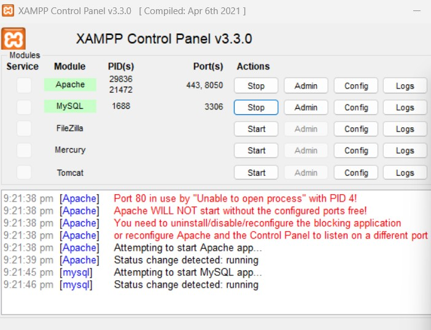 


-- Outcome --
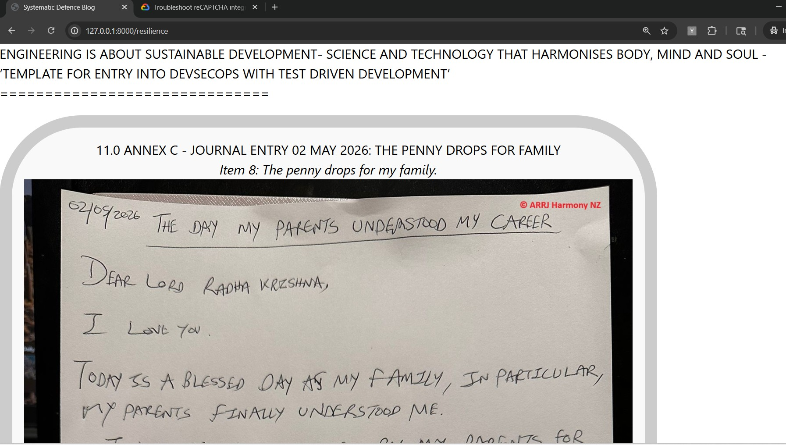 
css-and-images-working.jpg

b) Create database, and a user to access it:

-- 1. Create database that also supports Emojis and international characters
CREATE DATABASE IF NOT EXISTS blog_systematicdefence_tech
CHARACTER SET utf8mb4 
COLLATE utf8mb4_unicode_ci;


-- 2. Create the new user. My SQL cannot connect via socket connection (uses hosts name) or via TCP connection (uses host's IP address). Create user for both scenarios:

CREATE USER 'system-developer'@'%' IDENTIFIED BY <Supply Password 1>;

CREATE USER 'system-developer'@'127.0.0.1' IDENTIFIED BY <Supply Password 2>; 

-- 4. Grant all privileges on the specific database to both users:
GRANT ALL PRIVILEGES ON blog_systematicdefence_tech.* TO 'system-developer'@'%';
GRANT ALL PRIVILEGES ON blog_systematicdefence_tech.* TO 'system-developer'@'127.0.0.1'; 


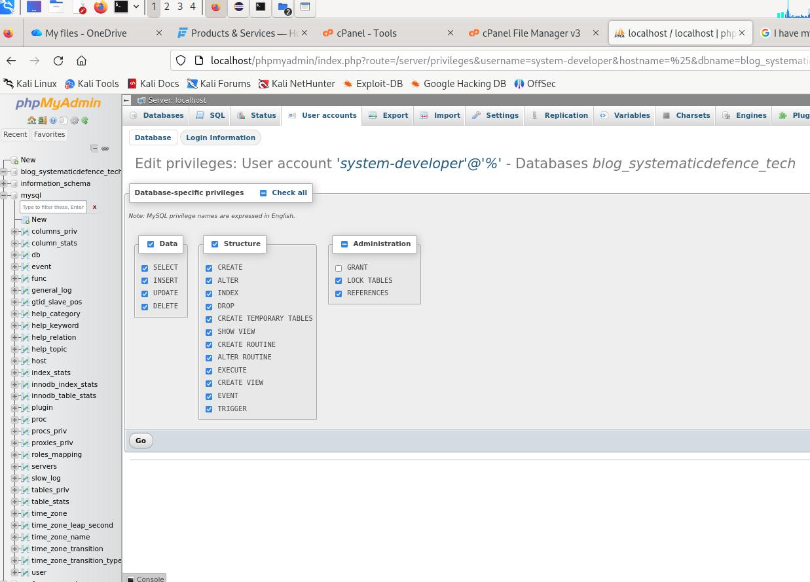 

-- 4. Apply the changes
FLUSH PRIVILEGES;

-- 5. Verify outcome
SELECT user, host, plugin FROM mysql.user; 

 --outcome:
 system-developer@% 
system-developer@127.0.0.1 
 
 -- 6. update .env

```txt
DB_CONNECTION=mysql
DB_PORT=3306
DB_HOST=127.0.0.1 
DB_USERNAME=system-developer 
DB_PASSWORD=<Password 2>

```
-- 7. Run Migrate on cmd, with seeders
php artisan migrate:fresh --seed

-- 8. Connect [public/storage] link to [storage/app/public]. 
php artisan storage:link

Key commands:

1. Create a new project

```
laravel new <project name>
```

2. Create Entity Framework equivalent Migration code, i.e code for creating db tables

```
php artisan make:migration create_comments_table
```

3. Create tables (requires working connection to DB)

```
php artisan migrate
```

4. Generate Entity Framework equivalent code for Comment class

```
php artisan make:model Comment
```

4. Generate Entity Framework equivalent Controller (EF controller equivalent)

```
php artisan make:controller CommentController
```
5. How to run app:

```php
php artisan serve
```

### 0.2
2 May 2026 Saturday 23:16: CSS and Images working locally:


1. How to run Vite, which renders css:

```
npm install
npm run dev
```
## 1.0
2 May 2026 Saturday 23:41: Basic skeleton of application working end to end:

1. Verified that comments functionality is working, with recaptchav2.

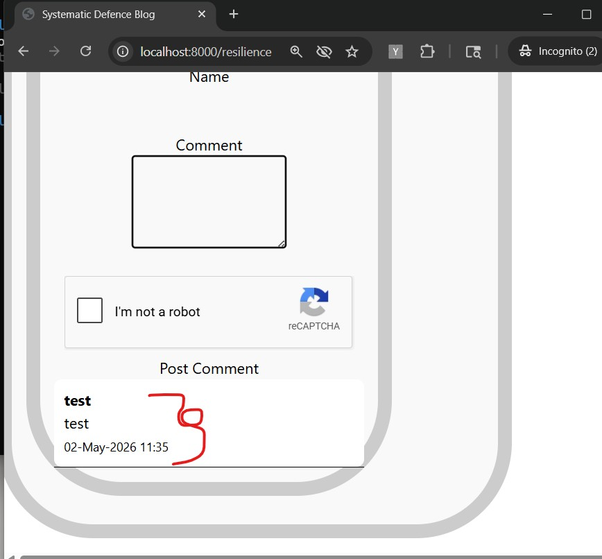 
css-and-images-working.jpg

2. Verified that connection to database working via app:

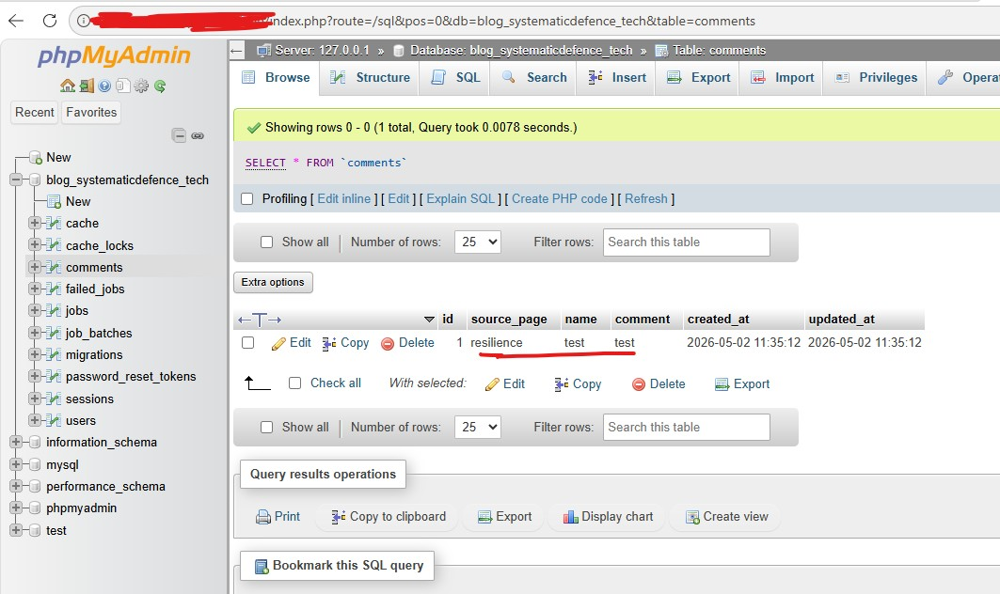 
css-and-images-working.jpg

### 1.1
06 May 2026: Added cookbook/MigrateToFastcomet.md

### 1.2
07 May 2026 20:46: Gradle Cucumber test operational. JUnit test not operational.
<br>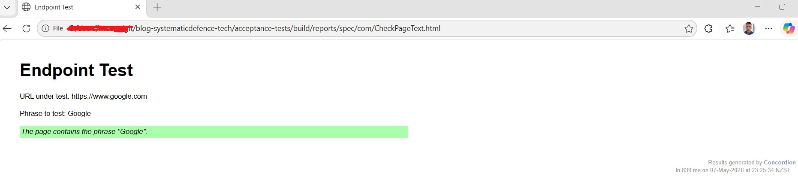 

## 1.3 
07 May 2026 21:10: Proof of Concept Cucumber and JUnit tests operational with Gradle.
<br>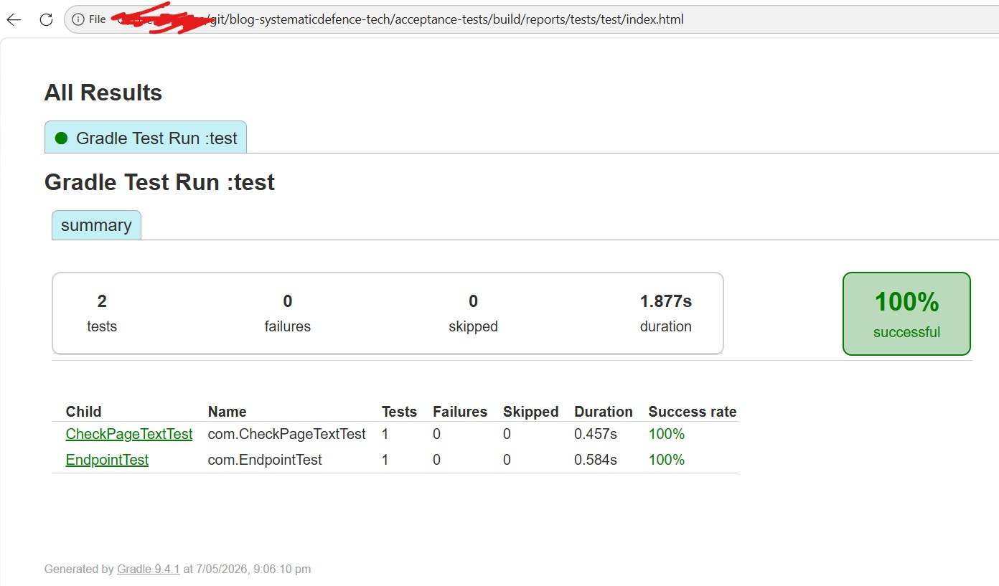 

## 1.4 
07 May 2026 21:10: Cucumber and JUnit tests operational with Gradle, for blog application.

Encountered and resolved Gradle quirks, PowerShell quirks, Concordion XML rules, JVM property forwarding, URL normalization, and debugging logic. Evidence of successful operation:

a) Cucumber:

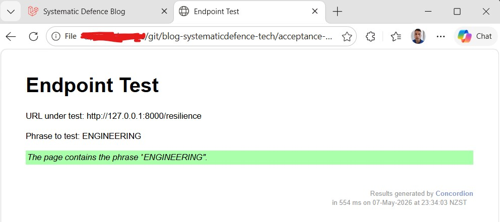 

b) Cucumber and Junit

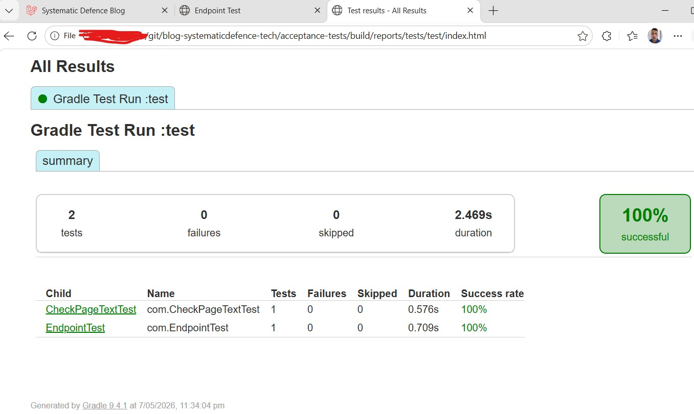 

Command used to get result:

```bash
- acceptance-tests>gradlew "-DexternalIp=http://127.0.0.1:8000/resilience" "-DtestPhrase=ENGINEERING" test
```

See also cookbook/GradleCucumberTroubshooting.md

### 1.41 
08 May 2026 20:21: Build Number operational. 

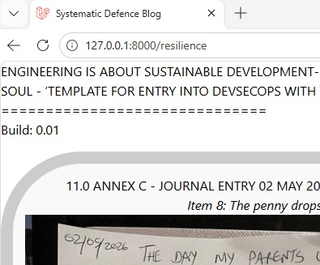 


Also see cookbook/LocalConfigurationmanagement.MD. Setting Build number in build_number.txt to 1.40, so on commit, it will become current.

### 1.42
09 May 2026 12:34: See cookbook/DataDrivenWebsite.md for successful case study of website which is entirely loaded from database at runtime.

### 1.43
09 May 2026 12:34: See cookbook/DataDrivenWebsite.md for extending the DATA DRIVEN WEBSITE SETUP to use 'What You See Is What You Get' (WYSIWYG) editor TinyMCE.

### 1.44
09 May 2026 11:37: Went down the TinyMCE route, but this editor changes a lot via upgrades. I created a create and edit / update page. Build number and image displaying, though had issues in html rendering. I need a stable version of the editor or no editor as I can handle writing HTML at the level I am currently operating. So, commiting progress, and then turning back

### 1.45
10 May 2026 00:54:
Data Driven website using default text editor provided by Laravel php - 'Text Area'. Now able to edit, and include audio. Edit page:

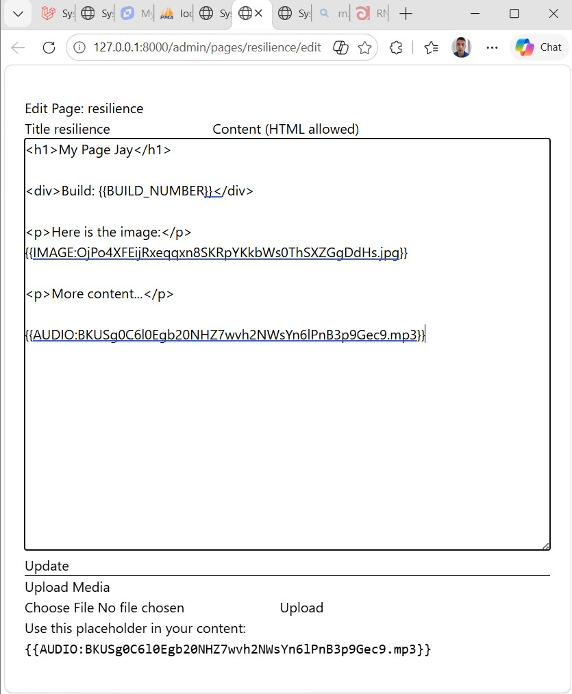 


Outcome of Edited document - Added Audio

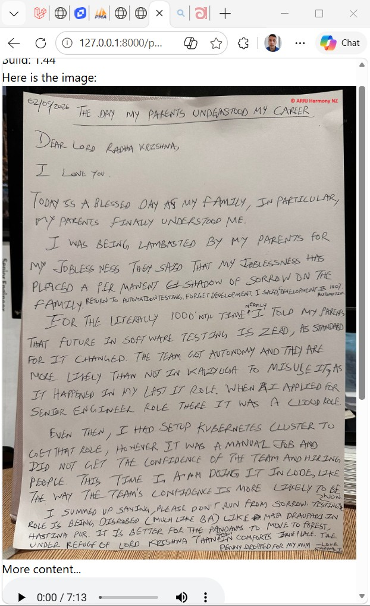 

Also see cookbook/LaravelQuirks.md, for the great things I have learnt that Laravel can offer!

### 1.46
12 May 2026 21:54:
Payment process is working using Paypal Developer account. Paypal chosed as though it charges more, low PCI standard related maintainance required. Documentation in document 'Deploy- Payment Integration Paypal LARAVEL.doc' Milestones:

1.0 Login working

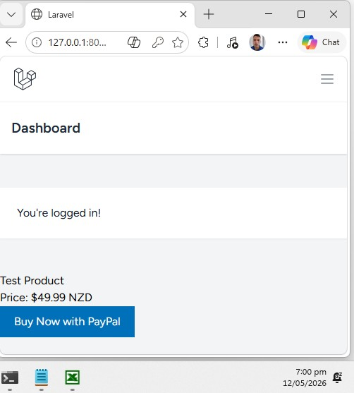 

2.0 Integration with Paypal evidence

 

3.0 Payment using Paypal- Trasaction succeeded

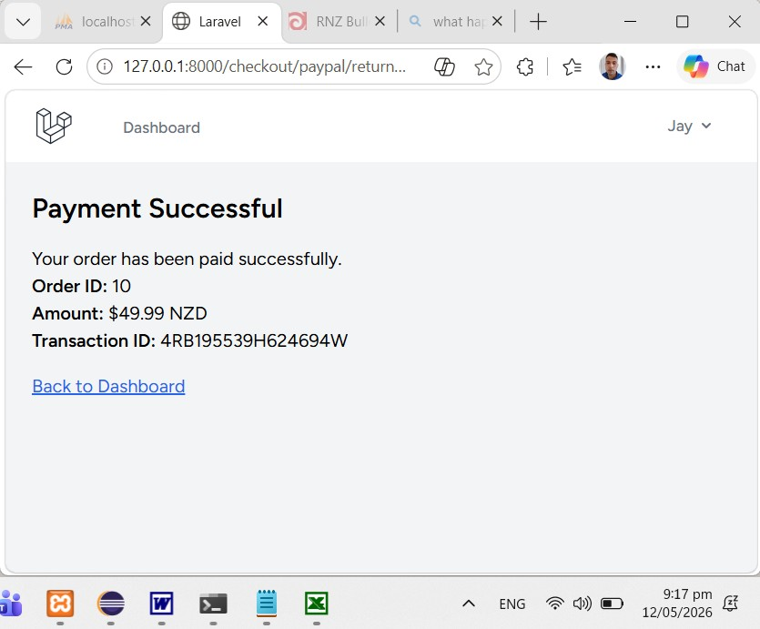 

4.0 CMS Regression

4.1 Resilience Page

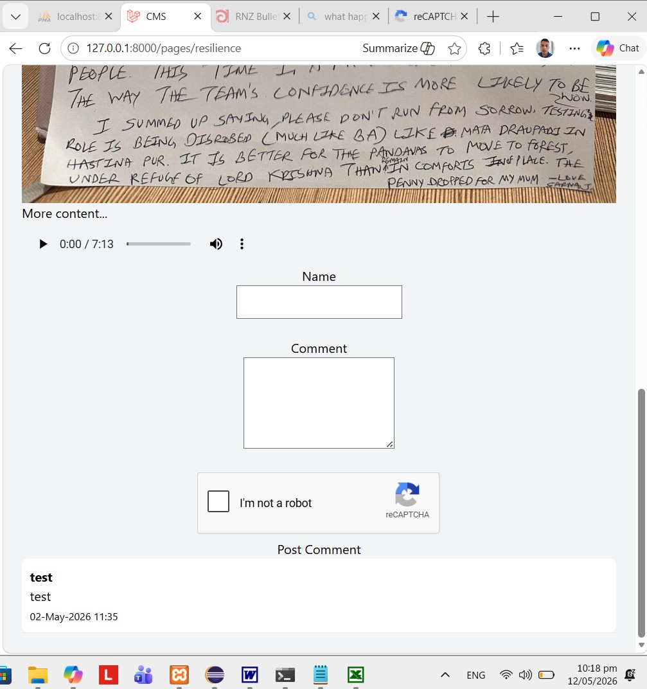 

4.2 Admin/create

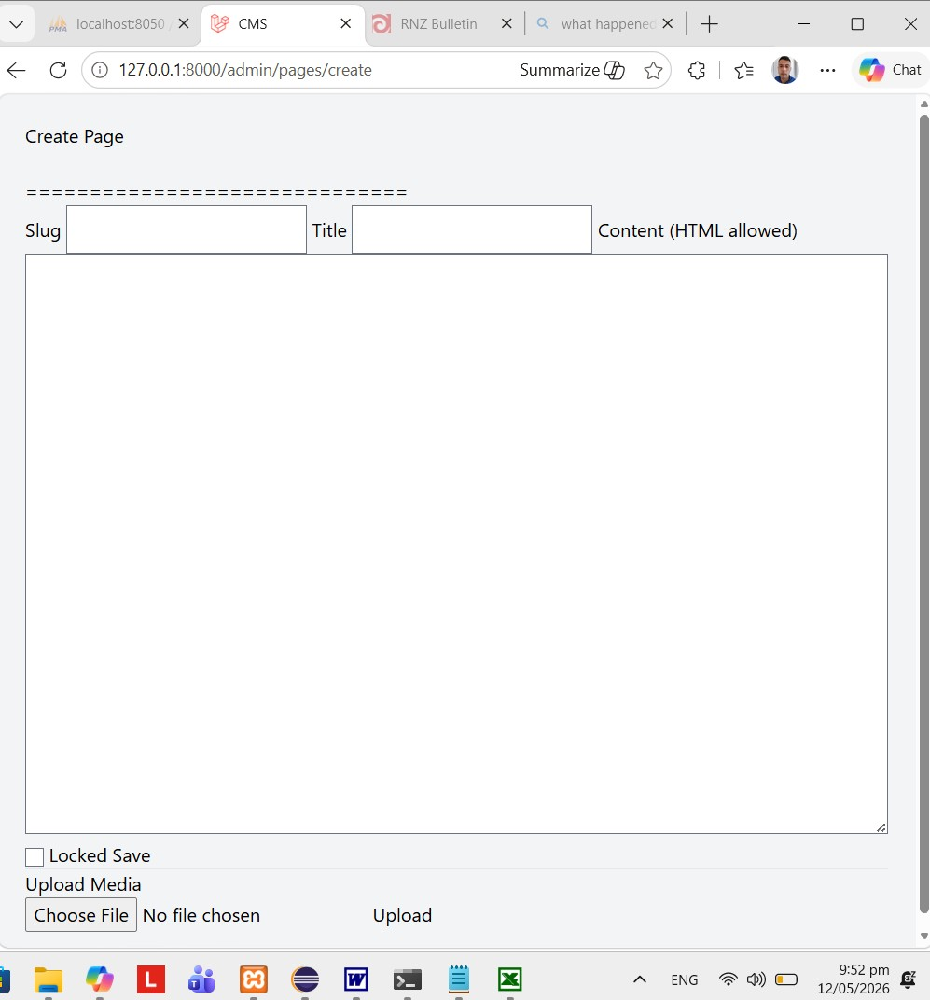 

4.3 Admin/edit

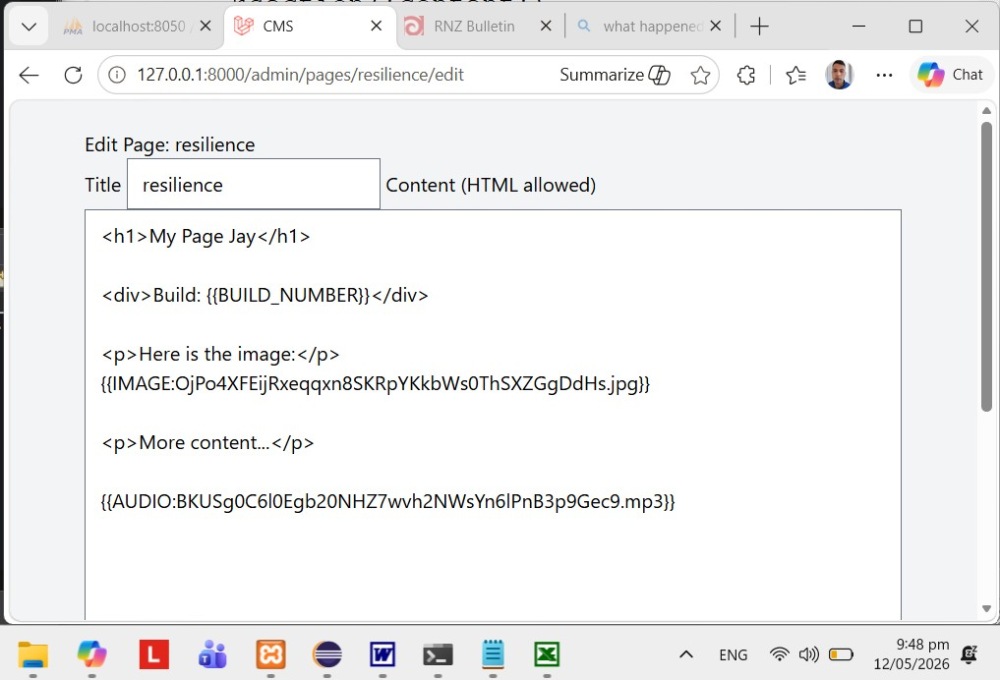 

### 1.47
13 May 2026 16:50:

a. Homepage ready 

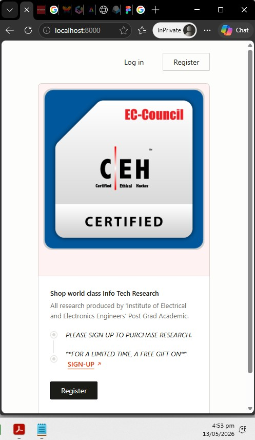

b. Dashboard rough plan out.
 
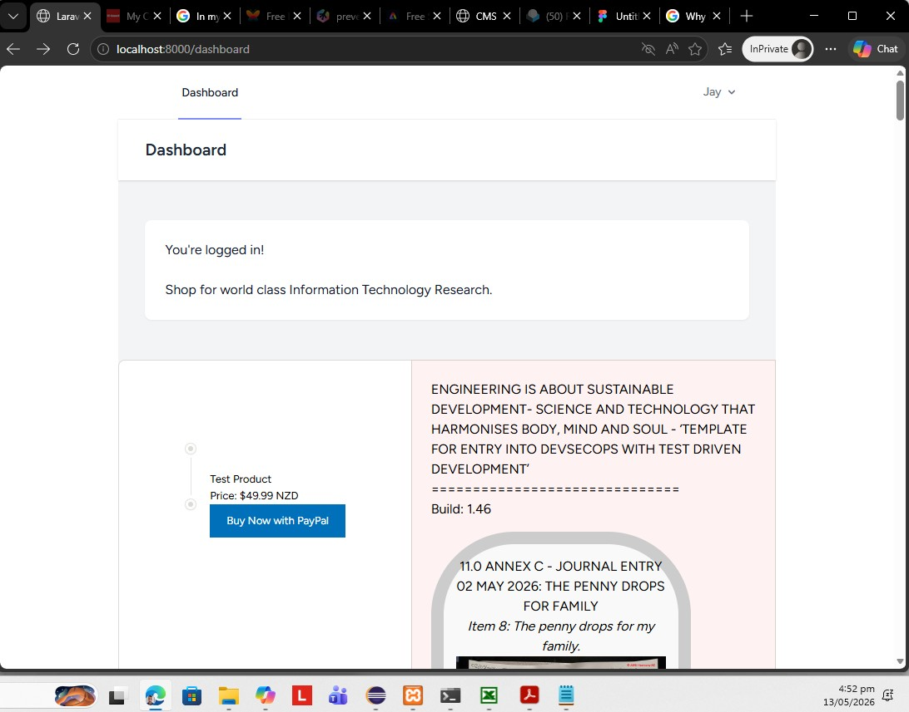
 
c. Quick visual checks verified no regression

### 1.48
14 May 2026 06:33:
Website operational locally


See 'Deploy- Shop DB and Page Flow Design and Implementation.doc' for details.

## 2.0
14 May 2026 Evening
Deployed to Production

### local 2.01
15 May 2026 22:00
Using Laravel's Sail package, dockerised application.  See .env.docker for sail db connection details. Also, prepared it for Azure Kubernetes (aks) Deployment via creating Azure MySQL flexible server and updating .env with appropriate connection details. Finally added dockerfile for aks. For full steps, see See 'Devsecops-tier4/DEVSECOPS-completion-attemptv1.doc'.

### local 2.03
16 May 2026 19:11 PM
App is working on Docker containers on DockerDesktop and WSL on windows too. Next step is to take to AKS. To test it on WSL, do the following:

a. Move folder to WSL with copy command
moose@AshwRenuJNitika:~/projects/$ rm -rf blog-systematicdefence-tech
moose@AshwRenuJNitika:~/projects/$ cp -r /mnt/c/Users/moose/git/blog-systematicdefence-tech .
b. composer dump-autoload
c. docker build -t aks-demo:latest .
d. docker run --rm -p 9000:9000 aks-demo:latest
e. docker ps
f. docker exec -it <container-id> sh
g. php artisan route:list

![App operational in WSL]
(./public/screenshots/AppOperationalInWSL.jpg)

### local 2.04
17 May 2026 13:37: Ensure storage/logs exists for Docker. Commit for Azure Kubernetes Service.

### local 2.05
17 May 2026 14:28: Fix Laravel directory structure for Docker. Updated .gitignore

### local 2.06
17 May 2026 15:23: added --no-plugins flag to 'php artisan config:cache' command, as the dev only packages were tripping build occuring in the production environment. 'npm run dev' handles JavaScript and CSS compilation locally, whereas --no-plugins controls how Laravel's PHP core handles third-party packages inside the Docker container. Hence, the 'npm run dev' cmd for front end assets, will not be affected by change to PHP configuration or Docker Build steps.

### local 2.07
Removed package caching from Dockerfile to stop docker build failing because composer install with run with --no-dev flag, and hence the dev packages keep tripping up the build. 

### kali linux 2.08
Laravel app working locally. Setup to connect to Production database and that has understandably failed due to permission issues.

## Kali linux 2.09
Laravel app working in containers with Mariadb container and PhpMyAdmin container. Details:
a) To start app, run:
sudo docker compose down -v
sudo docker compose up --build

b) When Launching for first time, after app up, run:
docker exec -it systematicdefence-app sh
php artisan migrate

## Kali linux 2.10
21 May 2026 10:47 PM: 
Preparation for merge with GitHub repository.

## Kali linux 2.11
22 May 2026 6 AM: 
Laravel application Functional on docker containers. See Cookbook>DockeriseApplication.md till Section 5 'STEPS TO SETUP APP ON DOCKER'

## Kali linux 2.12
22 May 2026 9:30 AM: 
First release of Knowledge Article cookbook/DockeriseApplication.md

## Kali linux 2.13
26 May 2026: 
Improved code and feedback loops. See Dockersie Applicaton Change Log Version 2.0.

## Kali linux 2.13 HOTFIX
26 May 2026: 
Added details of Pull Request in 'DockeriseApplicaton.md' 

## Kali linux 2.14 
29 May 2026: New branch created for hosting provider source.

## Kali Linux 2.15
Friday 29 May 2026 19:18: Updated .gitignore to enable git to commit folders that are needed by fastcomet. Also, identified that build number auto-increment is not functional at present. 

## Production 3.00
Tuesday 2 June 2026 16:30: Working in Production. To do so, I went to 'Manage SQL Databases', and to the db I added the worpress user. I changed the password for them, and then with following values in .env it worked:

```
DB_CONNECTION=mysql
DB_HOST="s4710.syd1.stableserver.net" 
DB_PORT=3306
DB_DATABASE='systema1_systematic_defence'
DB_USERNAME='systema1_wp552'
DB_PASSWORD='<redacted>'
```

Next aim is to Productionise it properly and add 'Under Development' signage in places like 'Reset Password'.  

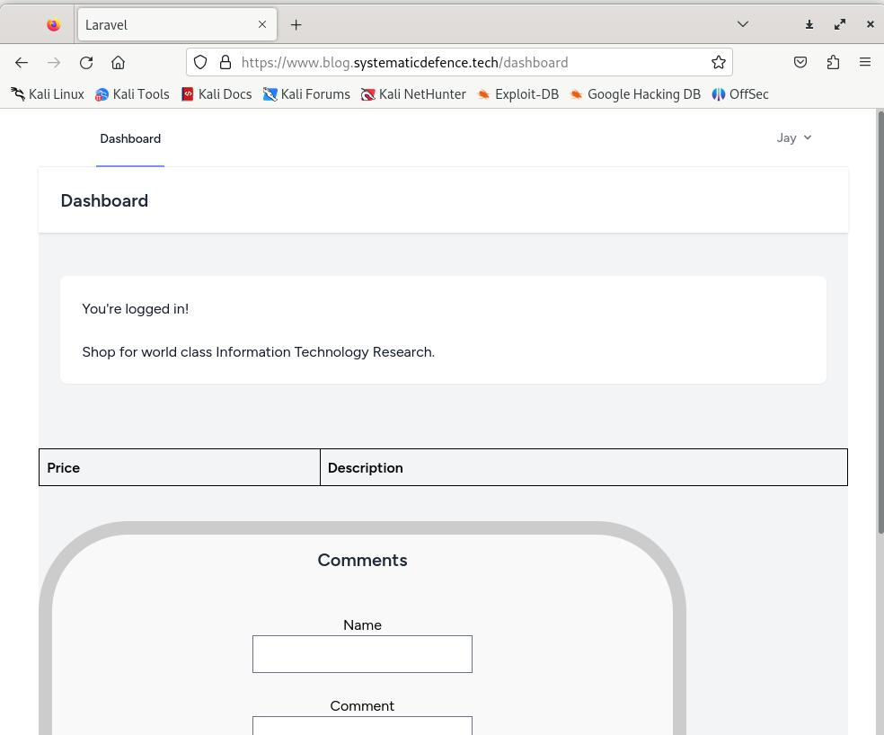

## Kali Linux version 3.01
Consolidation of working production locally.

## Kali Linux version 3.02 - Production App operational locally, with only host value in .env updated to 127.0.0.1
I pull the code of my live website in previous commit. It has no vendor or nodemodules folders because .gitignore prevented that from coming down. So running 'npm run dev', gets me error 'sh:1:vite:not found'. The fix:
a. composer install
b. npm install
c. npm run build
d. php artisan serve
e. npm run dev

CREATE USER 'systema1_wp552'@'127.0.0.1' IDENTIFIED BY '<password>'
CREATE USER 'systema1_wp552'@'localhost' IDENTIFIED BY '<password>'
GRANT ALL PRIVILEGES ON blog_systematicdefence_tech.* TO 'systema1_wp552'@'127.0.0.1';
GRANT ALL PRIVILEGES ON blog_systematicdefence_tech.* TO 'systema1_wp552'@'localhost';
FLUSH PRIVILEGES;
/opt/lampp/bin/mysql -u systema1_wp552 -p blog_systematicdefence_tech;

All of above worked, but UI gave me error SQLSTATE[42S02]. So I ran 'php artisan migration' cmd and this failed as code was geared to production database. So, I changed local .env to point to db with name same as production database and reran command. Fixed via:

CREATE DATABASE systema1_systematic_defence; 
GRANT ALL PRIVILEGES ON systema1_systematicdefence_tech.* TO 'systema1_wp552'@'127.0.0.1';
GRANT ALL PRIVILEGES ON systema1_systematicdefence_tech.* TO 'systema1_wp552'@'localhost';
php artisan migration:fresh

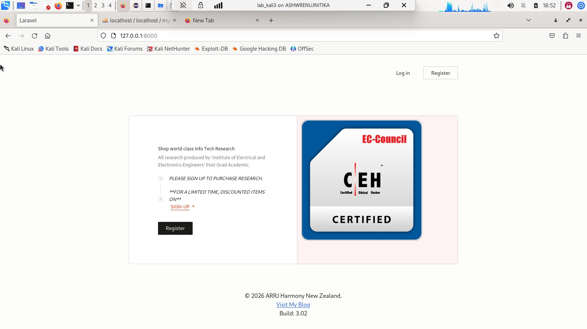
## Kali Linux version 3.03 - Production App fully operational locally except live payment
setup all the data via seeding. Ran:
- php artisan db:seed


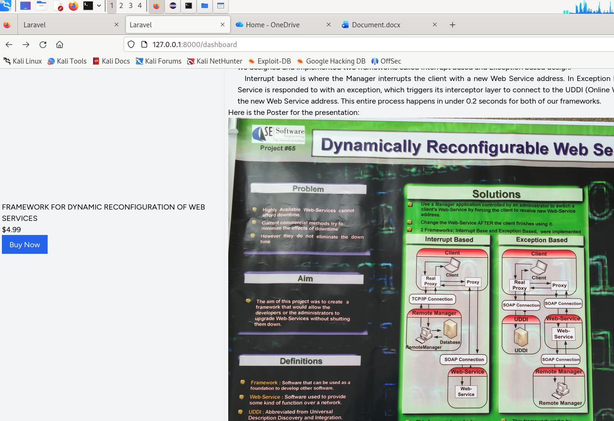

Finally, updated paypal to real keys. Bug:

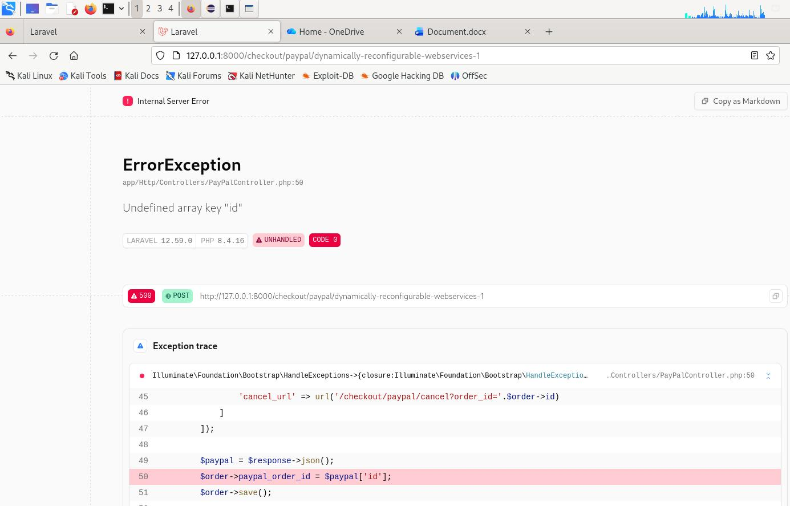
## Kali Linux version 4.00 - Production App fully operational

Email Working:

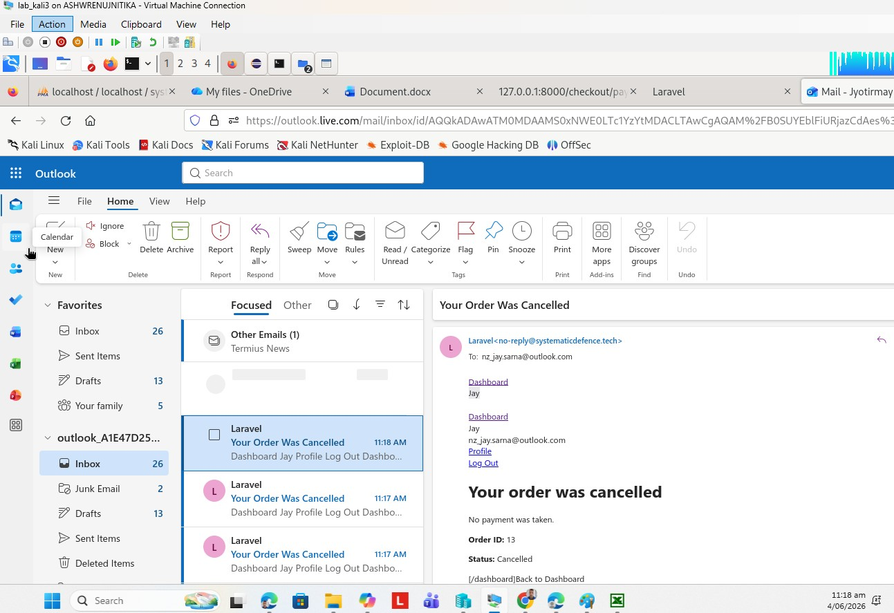

Live Purchase working:

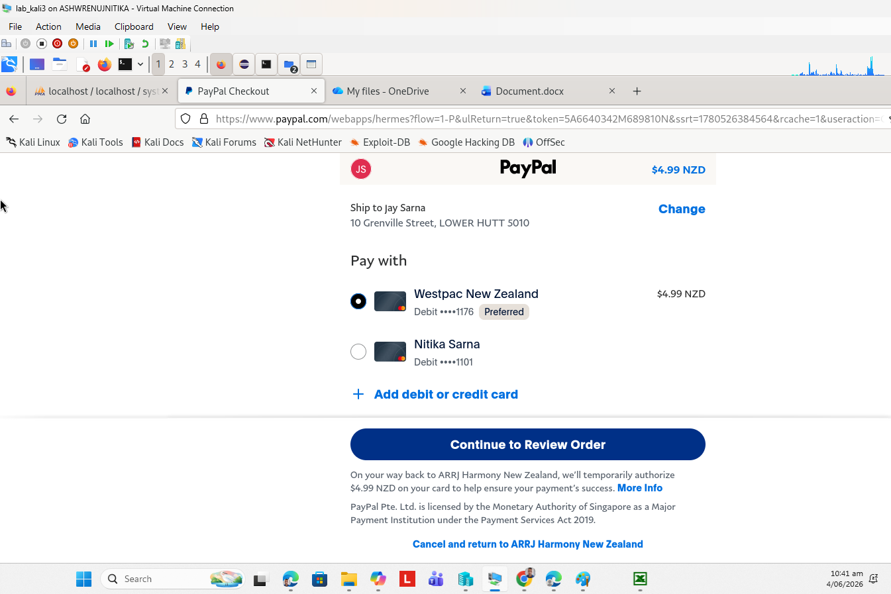

How: 
Added paypal environment variables for live endpoint, live client, live password and mode to enable switching between sandbox and live environments. For it to work, config/paypal.php also had to be updated accordingly. Wired up email via adding environment variables. Finally, updated database and app variables to suit Production. 

Once In Production, run: 

a) to upload data:

/opt/alt/php84/usr/bin/php artisan db:seed

b) recreate sym link, so images can display

/opt/alt/php84/usr/bin/php artisan storage:link

Proof of working app:

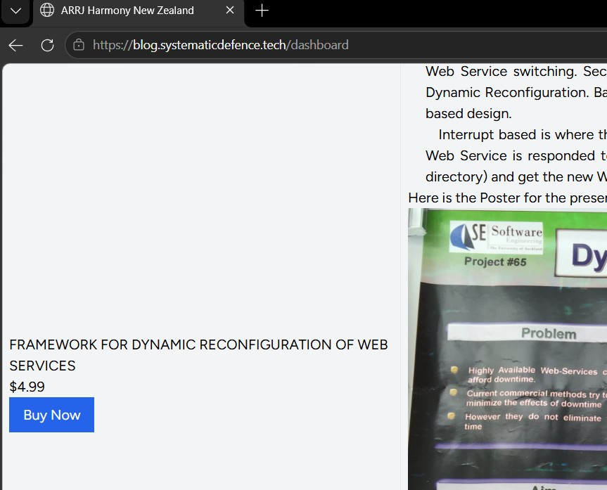

### Kali Linux version 4.01 - SOP for deployment
06 June 2026 12:33 PM: Created 'Standard Operating Procedures'/SOP for deployment to production - See cookbook/deployment.md. 

### Kali Linux version 4.02 - Production build and cleaned up for Production deployment 
SATURDAY 06 June 2026 16:53 HOURS: Updated 'Standard Operating Procedures'/SOP for deployment to production- See cookbook/deployment.md sections  4.2.3 and 6.2.1. 

### Kali Linux version 4.03 - Deployment to Production successful
SATURDAY 06 June 2026 19:45 HOURS: Updated 'Standard Operating Procedures'/SOP for deployment to production- See cookbook/deployment.md sections 7.0 Troubleshooting. The app is working again in Production, and Github does not show commerically sensitive information anymore. Automation of deployment could not be achieved as some essential files do not exist in Github and need to be manually setup after git pull from Production. 

## Kali Linux version 4.04
MONDAY 9 June 2026 10:43 HOURS: Updates to humanity.php and life.html. Also identified broken access control vulnerability - See cookbook/security-hardening.md. 

## Kali Linux version 4.05
WEDNESDAY 10 June 2026 13:52 HOURS: Added fix for directory traversal vulnerability - See cookbook/security-hardening.md for evidence. 

## Kali Linux version 4.06
FRIDAY 12 June 2026 17:53 HOURS: Added HTML reporting of tests - See Cookbook/Decoding-testing.md STEP 1. 

## Kali Linux version 4.07
FRIDAY 12 June 2026 08:56 HOURS: Fixed tests:

- 'tests/Feature/Auth/AuthenticateTest.php' >  'public function test_users_can_authenticate_using_the_login_screen(): void'

See Decoding-testing.md Section 1.2 'Troubleshoot failing tests'.

Also improved reporting. Also  Decoding-testing.md ## 1.1 Setup for first successful test run. 

## Kali Linux version 4.08
SATURDAY 13 June 2026 16:23 HOURS: Added tests for playright, including feature file. Turned subfolder laravel-playwright-poc into a project in its own right. 

## Kali Linux version 4.09
SUNDAY 14 June 2026 16:23 HOURS: BDD and Playwright tests all working. Git hub integation code present that runs CI pipeline and uploads artefacts. 

## Kali Linux fastcomet-github version 4.10
SUNDAY 14 June 2026 18:39 HOURS: Updated Readme.md
