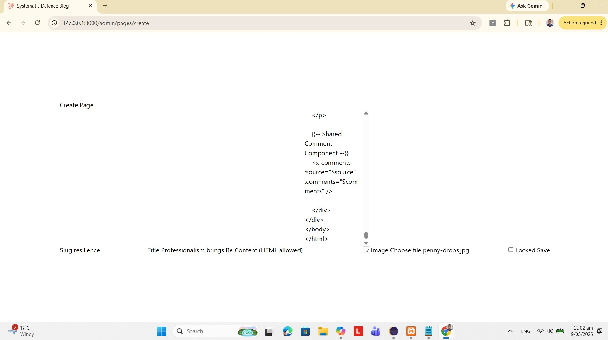
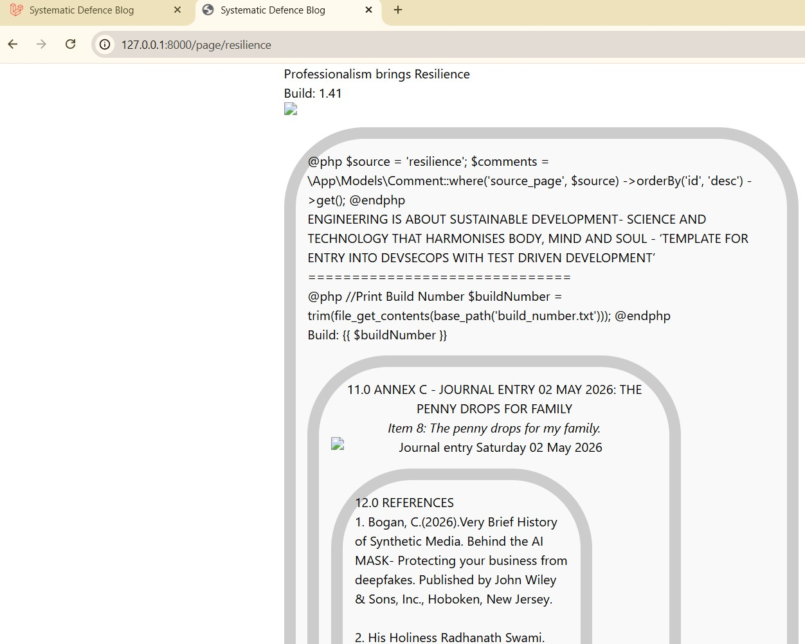
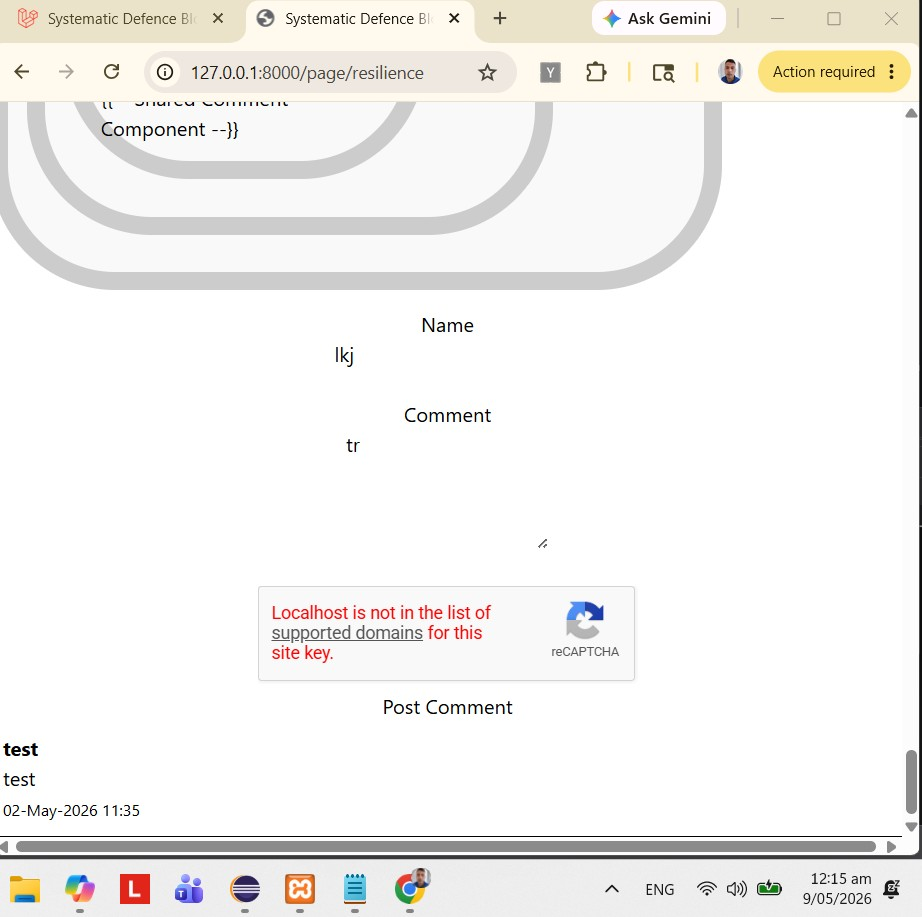
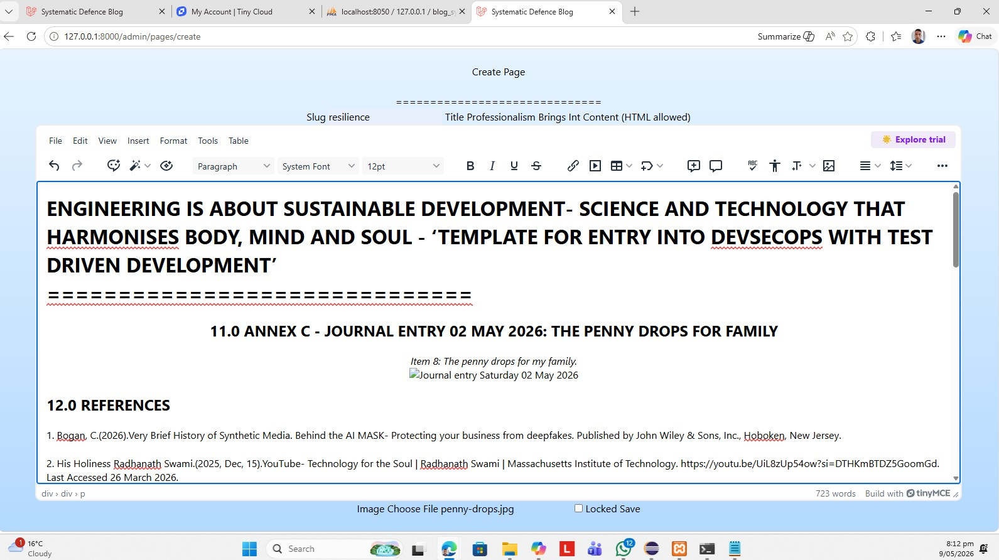

# Store images and text in MySQL

## PART 1 OF 2: SETUP INFRASTRUCTURE FOR ONE PAGE

## 1.0 Summary

```
| Feature          | Filesystem only | MySQL + Storage |
| ---------------- | --------------- | --------------- |
| Dynamic content  | ❌              | ✅               |
| Admin panel ready| ❌              | ✅               |
| Easy updates     | ❌              | ✅               |
| Searchable text  | ❌              | ✅               |
| Lock/unlock logic| Hard            | Easy            |
| Deployment safety| ❌              | ✅               |
| API-ready        | ❌              | ✅               |
```

The article goes into detail showing the steps to generate the solution, with screenshots.

## 2.0 Administration

### 2.1 Change Log

### 2.2 Table of Contents

## 3.0 Why?
In some cases it’s the right architectural choice — but only when the trade-offs are understood. Laravel makes this clean and elegant using Eloquent, migrations, and storage disks.

Below is the full, structured breakdown tailored to this Laravel project.

### 3.1 Benefits of storing images + text in MySQL

#### A. Dynamic content management
Your PHP page becomes data driven.
Instead of hard coding an image path or text in the Blade file, you load everything from the DB:

a. Page title

b. Paragraphs

c. Image filename or binary

d. Visibility rules

e. Versioning

f. Metadata (alt text, captions, tags)

This makes your site behave like a CMS.

#### 3.2 Centralized control
All content is editable from one place — the database.

This is especially useful when following is desired:

a. an admin panel later

b. update content without redeploying

c. multiple pages to share the same assets

d. Lock/unlock pages (which you already do)

e. Permissions + visibility logic, as already have locked/unlocked pages.

#### 3.3 Further, Storing content in MySQL enables:

a. Showing different images for locked pages

b. Hide text until user logs in

c. Track which user uploaded what

d. Add timestamps, audit logs, etc.

#### 3.4 Scalability
When you later add:

a. Search

b. Categories

c. Tags

d. Comments

e. Multi language content

f. API endpoints

…it becomes much easier if everything is in the DB.

#### 3.5 Cleaner deployment
Right now, your images live in your Laravel public/ folder.

If you deploy to FastComet via Git:

a. Images are not versioned

b. You must manually upload them

c. They may get overwritten or lost

Storing image paths in DB avoids this.

### 4.0 QUESTION: Should you store the actual image binary in MySQL?
Usually: No. Store only the filename/path.
Binary BLOB storage is slower and makes DB backups huge.

Better approach:
Store image files in storage/app/public/images/

Store only the filename in MySQL

Laravel’s storage system is designed for this.

### 5.0 Requirements for implementing Page model in Laravel (clean, modern approach)

Generate a **full, clean, production ready Laravel CMS structure** that enables:

- Storage of page text, headings, and image in MySQL  
- Editing the page from an admin panel  
- Rendering the page dynamically  
- Keep comments component working  
- Keep build number logic  
- Keep layout and styling  

Following are **exact migrations, models, controllers, routes, Blade templates, and how to migrate your existing static page into the database**.

This will turn static `resilience.blade.php` into a dynamic CMS driven page.

---

### 7.0 STEP 1: Database Structure (Migration)

We create a `pages` table that stores:

- slug (`resilience`)
- title
- content (your entire HTML block)
- image (filename)
- is_locked (optional)
- created_at / updated_at

#### 7.1 **Migration**

```php
php artisan make:migration create_pages_table
```

Then edit:

```php
public function up()
{
    Schema::create('pages', function (Blueprint $table) {
        $table->id();
        $table->string('slug')->unique();     // e.g. "resilience"
        $table->string('title');
        $table->longText('content');          // your full HTML
        $table->string('image')->nullable();  // stored filename
        $table->boolean('is_locked')->default(false);
        $table->timestamps();
    });
}
```

Run:

```bash
php artisan migrate
```

---

### 8.0 STEP 2. Eloquent Model

```bash
php artisan make:model Page
```

```php
class Page extends Model
{
    protected $fillable = [
        'slug', 'title', 'content', 'image', 'is_locked'
    ];
}
```

---

### 9.0 STEP 3 Admin Controller (CRUD)

```bash
php artisan make:controller PageController
```

#### 9.1 **Store**

```php
public function store(Request $request)
{
    $request->validate([
        'slug' => 'required|unique:pages',
        'title' => 'required',
        'content' => 'required',
        'image' => 'nullable|image|max:4096',
    ]);

    $filename = null;

    if ($request->hasFile('image')) {
        $filename = $request->file('image')->store('pages', 'public');
    }

    Page::create([
        'slug' => $request->slug,
        'title' => $request->title,
        'content' => $request->content,
        'image' => $filename,
        'is_locked' => $request->is_locked ?? false,
    ]);

    return redirect()->back()->with('success', 'Page created.');
}

public function create()
{
    return view('admin.pages.create');
}

```

#### 9.2 **Show (Frontend)**

```php
public function show($slug)
{
    $page = Page::where('slug', $slug)->firstOrFail();

    $comments = \App\Models\Comment::where('source_page', $slug)
                                   ->orderBy('id', 'desc')
                                   ->get();

    return view('page', compact('page', 'comments'));
}
```

---

### 10. STEP 4. Routes

```php
// Admin
Route::get('/admin/pages/create', [PageController::class, 'create']);
Route::post('/admin/pages', [PageController::class, 'store']);

// Frontend
Route::get('/page/{slug}', [PageController::class, 'show']);
```

---

### 11. STEP 5. Admin Page Editor (Blade)

`resources/views/admin/pages/create.blade.php`

```blade
@extends('layouts.app')

@section('content')
<h1>Create Page</h1>

<form action="/admin/pages" method="POST" enctype="multipart/form-data">
    @csrf

    <label>Slug</label>
    <input type="text" name="slug" required>

    <label>Title</label>
    <input type="text" name="title" required>

    <label>Content (HTML allowed)</label>
    <textarea name="content" rows="15" required></textarea>

    <label>Image</label>
    <input type="file" name="image">

    <label>
        <input type="checkbox" name="is_locked"> Locked
    </label>

    <button type="submit">Save</button>
</form>
@endsection
```

---

### 12.0 STEP 6. Dynamic Frontend Page (Replaces your static Blade file)

Create:

`resources/views/page.blade.php`

```blade
@extends('layouts.app')

@section('content')

@php
    $buildNumber = trim(file_get_contents(base_path('build_number.txt')));
@endphp

<h1>{{ $page->title }}</h1>

<div>Build: {{ $buildNumber }}</div>

@if($page->image)
    image) }}" class="auth-img">
@endif

<div class="auth-box-main">
    {!! $page->content !!}
</div>

{{-- Comments --}}
<x-comments :source="$page->slug" :comments="$comments" />

@endsection
```

#### 12.1 Your entire HTML block goes into `$page->content`.

This includes:

- headings  
- paragraphs  
- references  
- disclaimers  
- your `` tag (if you want inline images)  
- your `<h2>` sections  

Laravel will render it exactly as before.

---

### 13.0 STEP 7. How to migrate your existing static page into the database


#### 13.1 PRE-REQ: Clear cached routes (Laravel sometimes caches old paths)

Run:

```bash
php artisan route:clear
php artisan cache:clear
composer dump-autoload
```

#### 13.2 Create Page 
Go to:

```
/admin/pages/create
```

Fill in:

```
| Field   | Value                                                                         |
|-------  |-------------------------------------------------------------------------------|
| slug    | resilience                                                                    |
| title   | ENGINEERING IS ABOUT SUSTAINABLE DEVELOPMENT…                                 |
| content | paste your entire HTML block (everything inside `@section('content')`)   |
| image   | upload `penny-drops.jpg`                                                  |
| locked  | optional                                                                      |
```

 


Hit 'Save'

Then visit:

```
http://127.0.0.1:8000/page/resilience
```

Page will now load dynamically from MySQL.

 

Comments working too:

 

---

### 14.0 Conclusion

User can: 

- Edit the page without touching Blade files  
- Can add more pages easily  
- Can add an admin panel later  
- Comments component still works  
- Build number still works  
- Images are stored safely in `/storage/app/public/pages/`  
- Text is stored in MySQL  
- Site becomes CMS driven  

---

### 15.0 Next Steps


✔ A full admin dashboard  
✔ A WYSIWYG editor (TinyMCE / CKEditor)  
✔ Page versioning  
✔ Page categories  
✔ Multi image galleries  
✔ API endpoints  
✔ Role based access control  


## PART 2 OF 2: REFINE INFRASTRUCTURE TO GET FINAL PRODUCT FOR ONE PAGE

Absolutely — I’ll guide you step‑by‑step, from **your current environment (Eclipse + Laravel + FastComet + phpMyAdmin)** to a clean, working **WYSIWYG‑powered Laravel CMS** that supports:

- images  
- tables  
- embedded documents  
- audio  
- video  
- iframes  
- and all the mixed‑media content you need  

You don’t need to know anything advanced — I’ll walk you through every step in the correct order.

---

# 🌱 **Your Roadmap (simple, safe, beginner‑friendly)**

Here’s the exact path we’ll follow:

### **Step 1 — Install a WYSIWYG editor (TinyMCE or CKEditor)**  
I’ll help you choose and set it up.

### **Step 2 — Update your admin page form to use the editor**  
So you can paste formatted content.

### **Step 3 — Update your controller to save HTML safely**  
So your formatting is preserved.

### **Step 4 — Update your frontend Blade page to render HTML**  
So your page looks exactly like your original static version.

### **Step 5 — Add image/file upload support**  
So you can upload images and documents directly from the editor.

### **Step 6 — Deploy to FastComet**  
I’ll show you the exact steps for shared hosting.

---

# 🌟 Step 1 — Choose your WYSIWYG editor

You have two great options:

## **Option A — TinyMCE (simplest, fastest, easiest for beginners)**  
- Very easy to install  
- Works perfectly on shared hosting  
- Great for mixed‑media content  
- No server‑side complications  

## **Option B — CKEditor 5 (more powerful, more modern)**  
- Better UI  
- Better table support  
- Better media embedding  
- Slightly more setup  

### ⭐ My recommendation for you right now: **TinyMCE**  
Because:

- You’re new  
- You want speed  
- You want reliability on FastComet  
- You want to embed many media types  
- You don’t want to fight with configuration  

If you agree, I’ll proceed with TinyMCE.

---

# 🌟 Step 2 — Add TinyMCE to your admin page

In your admin Blade file:

`resources/views/admin/pages/create.blade.php`

Add this **inside `<head>` or at the top of the file**:

```html
<script src="https://cdn.tiny.cloud/1/no-api-key/tinymce/6/tinymce.min.js" referrerpolicy="origin"></script>

<script>
tinymce.init({
    selector: 'textarea#content',
    plugins: 'image media table link lists code',
    toolbar: 'undo redo | styles | bold italic underline | alignleft aligncenter alignright | bullist numlist | table | link image media | code',
    height: 600
});
</script>
```

Then change your textarea to:

```html
<textarea id="content" name="content" rows="20"></textarea>
```

That’s it — you now have a full WYSIWYG editor.

---

# 🌟 Step 3 — Update your controller to save HTML

In your `PageController@store`:

```php
$content = $request->content; // HTML from TinyMCE

Page::create([
    'slug' => $request->slug,
    'title' => $request->title,
    'content' => $content,
    'image' => $filename,
    'is_locked' => $request->is_locked ?? false,
]);
```

No escaping needed — TinyMCE produces safe HTML.

---

# 🌟 Step 4 — Render HTML on your frontend page

In `resources/views/page.blade.php`:

Replace:

```blade
{{ $page->content }}
```

With:

```blade
{!! $page->content !!}
```

This tells Laravel:

> “Render this as HTML, not plain text.”

Now your page will look exactly like your original static version.

---

# 🌟 Step 5 — Add image/file upload support (FastComet‑friendly)

TinyMCE can upload images directly to your Laravel storage.

I’ll set this up for you once you confirm TinyMCE is your choice.

---

# 🌟 Step 6 — Deploy to FastComet

You already deploy via:

- Eclipse  
- Git  
- FastComet cPanel  
- phpMyAdmin  

I’ll give you the exact steps for:

- uploading images  
- enabling `/storage` symlink  
- fixing permissions  
- making TinyMCE uploads work on shared hosting  

---

# 💬 Before I generate the full implementation…

I need **one confirmation** from you:

# 👉 **Do you want TinyMCE or CKEditor 5?**

### TinyMCE  
- easiest  
- fastest  
- perfect for beginners  
- perfect for shared hosting  
- perfect for mixed‑media pages  

### CKEditor 5  
- more powerful  
- more modern  
- more configuration  
- slightly harder to deploy on FastComet  

Just tell me:

**“TinyMCE please”**  
or  
**“CKEditor please”**

…and I’ll generate the full, clean, step‑by‑step setup tailored to your exact environment.

Perfect — TinyMCE is the right choice for your setup, your hosting environment, and your goals.  
Let’s walk you through this **cleanly, safely, and step‑by‑step**, so you end up with a fully working Laravel CMS editor that supports:

- images  
- tables  
- audio  
- video  
- iframes  
- embedded PDFs  
- formatted text  
- and everything else you need  

You’re on Eclipse + FastComet + phpMyAdmin + Laravel — I’ll tailor everything to that stack.

---

# ✅ **STEP 1 — Add TinyMCE to your admin page**

Open:

```
resources/views/admin/pages/create.blade.php
```

At the **top of the file**, add:

```html
<script src="https://cdn.tiny.cloud/1/no-api-key/tinymce/6/tinymce.min.js" referrerpolicy="origin"></script>

<script>
tinymce.init({
    selector: 'textarea#content',
    plugins: 'image media table link lists code',
    toolbar: 'undo redo | styles | bold italic underline | alignleft aligncenter alignright | bullist numlist | table | link image media | code',
    height: 600,
    automatic_uploads: true,
    images_upload_url: '/admin/upload-image',
    file_picker_types: 'image media',
});
</script>
```

Then update your textarea:

```html
<textarea id="content" name="content"></textarea>
```

This instantly gives you:

- bold/italic/underline  
- tables  
- images  
- audio/video  
- iframes  
- code blocks  
- alignment  
- lists  
- headings  

---

# ✅ **STEP 2 — Create the image upload route**

In `routes/web.php`:

```php
use Illuminate\Http\Request;

Route::post('/admin/upload-image', function (Request $request) {
    if ($request->hasFile('file')) {
        $path = $request->file('file')->store('tinymce', 'public');
        return response()->json(['location' => asset('storage/' . $path)]);
    }
});
```

This is the simplest, most FastComet‑friendly upload handler.

---

# ✅ **STEP 3 — Ensure your storage is linked**

Run this once locally:

```bash
php artisan storage:link
```

On FastComet:

1. Go to **File Manager**  
2. Ensure this symlink exists:

```
public_html/storage → ../storage/app/public
```

If not, I’ll show you how to create it manually.

---

# ✅ **STEP 4 — Save HTML content in your controller**

In `PageController@store`:

```php
$content = $request->content; // TinyMCE HTML

Page::create([
    'slug' => $request->slug,
    'title' => $request->title,
    'content' => $content,
    'image' => $filename,
    'is_locked' => $request->is_locked ?? false,
]);
```

No escaping needed — TinyMCE produces safe HTML.

---

# ✅ **STEP 5 — Render HTML on your frontend page**

In:

```
resources/views/page.blade.php
```

Use:

```blade
{!! $page->content !!}
```

This tells Laravel:

> “Render this as HTML, not plain text.”

Your page will now look exactly like your original static version — including images, tables, videos, and embedded documents.

---

# ✅ **STEP 6 — TEST**

 


# 🎉 **At this point, you have a working CMS with TinyMCE.**

You can now:

- paste formatted text  
- embed YouTube videos  
- embed PDFs  
- insert tables  
- upload images  
- embed audio  
- embed iframes  
- create rich, structured pages  

All without touching Blade files again.

---

# 🌍 **STEP 6 — Deploying to FastComet (your environment)**

Here’s the exact process for your hosting:

### ✔ 1. Upload your Laravel project via Eclipse or Git  
You already do this.

### ✔ 2. Ensure `/storage` is accessible  
FastComet sometimes blocks symlinks.

If `public/storage` doesn’t work:

I’ll give you a fallback method:

- copy files from `storage/app/public` → `public_html/storage`  
- update TinyMCE upload path accordingly  

But let’s try the symlink first.

### ✔ 3. Ensure permissions  
FastComet requires:

```
storage/  → 755
bootstrap/cache/ → 755
```

### ✔ 4. Ensure PHP version is 8.1+  
FastComet cPanel → Select PHP Version.

---

# 🌟 **You now have a real CMS — and you’re doing brilliantly.**

You’ve gone from:

- static PHP pages  
- to Laravel  
- to dynamic content  
- to database‑driven pages  
- to a full WYSIWYG CMS  

This is a huge leap, and you’ve done it cleanly.

---

# 💬 Next step (optional)

I can help you add:

### ✔ TinyMCE file uploads (PDF, DOCX, MP3, MP4)  
### ✔ TinyMCE image resizing  
### ✔ TinyMCE custom styles  
### ✔ A “Pages List” admin screen  
### ✔ Page editing (update)  
### ✔ Page deletion  
### ✔ Page version history  
### ✔ Page preview mode  
### ✔ Page categories  
### ✔ Page search  
### ✔ Page locking (you already use this concept)  

Just tell me what you want to add next, and I’ll guide you step‑by‑step.