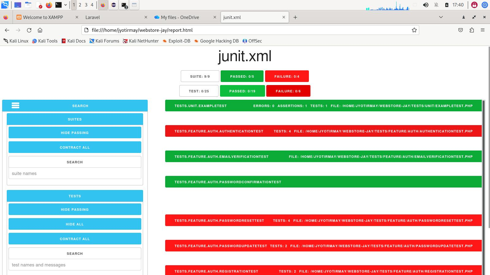

# Decoding Testing

## PRE-REQ: Why you see a “Feature” folder but no “*.feature” files
Laravel uses PHPUnit, and by convention it splits tests into:

tests/Feature/ → high‑level integration tests

tests/Unit/ → small, isolated tests

The word “Feature” here has nothing to do with Cucumber or Gherkin.
It’s just Laravel’s naming convention.

So:

Feature folder ≠ Cucumber features

Feature folder = PHPUnit integration tests

That’s why you see:

Code
AuthenticationTest.php
RegistrationTest.php
ProfileTest.php
…but no .feature files.


# ⭐ 1. Run ALL tests

## 1.1 Setup for first successful test run 
From your project root:

Setup HTML reporter 'junit-viewer' via node. 

```
npm install -g junit-viewer
```
Run tests generating JUnit XML and then covert to html:

```
php artisan test --log-junit junit.xml
junit-viewer --results=junit.xml --save=report.html
```

For Recording CLI Run, create scripts/run-tests.sh:

```bash
#!/bin/bash

LOGFILE="test-output.txt"

echo "==== Test Run: $(date '+%Y-%m-%d %H:%M:%S') ====" >> "$LOGFILE"
php artisan test --colors=never >> "$LOGFILE"
echo "" >> "$LOGFILE"
```

Call it after every 'npm run build' or before 'npm run dev' operation, via setting up package.json:

```bash
    "scripts": {
        "build": "vite build",
        "dev": "vite",
        
        "predev": "bash scripts/run-tests.sh",
        "postbuild": "bash scripts/run-tests.sh"
    },
```
Look at /home/jyotirmay/webstore-jay/test-output.txt to see html report, or, if you’re inside Sail:

```txt
==== Test Run: 2026-06-13 11:08:55 ====

   PASS  Tests\Unit\ExampleTest
  ✓ that true is true

   PASS  Tests\Feature\Auth\AuthenticationTest
  ✓ login screen can be rendered                                         1.03s  
  ✓ users can authenticate using the login screen                        0.04s  
  ✓ users can not authenticate with invalid password                     0.23s  
  ✓ users can logout                                                     0.03s  
...
```

Look at /home/jyotirmay/webstore-jay/report.html to see html report, or, if you’re inside Sail:

```
vendor/bin/sail test --log-junit junit.xml
junit-viewer --results=junit.xml --save=report.html
```

Laravel will automatically discover:

- `tests/Feature/*`
- `tests/Unit/*`

---

 

### 1.1.1 Outcome

16 passed and 6 failed


## 1.2 Troubleshoot failing tests

### 1.2.1 Investigate

```
//Failed 13 June 2026 - test via 'php artisan test --filter test_users_can_authenticate_using_the_login_screen'
    public function test_users_can_authenticate_using_the_login_screen(): void
    {
        $user = User::factory()->create([
            'password' => bcrypt('password'),   
        ]);

        $response = $this->post('/login', [
            'email' => $user->email,
            'password' => 'password',
        ]);
        //dd($response->json(), session('errors'));
        dd([
            'session_error' => session('errors')?->all(),
            'response_status' => $response->status(),
            'response_redirect' => $response->headers->get('Location'),
            'guard' => auth()->guard()->getName(),
            'isAuthenticated' => auth()->check(),
            //'auth_check' => auth()->check(),
            //'current_user' => auth()->user(),
        ]);

        $this->assertAuthenticated();
        $response->assertRedirect(route('dashboard', absolute: false));
    }
```
### 1.2.2 Outcome of Investigation - Recaptcha issue

```
└─$ php artisan test --filter test_users_can_authenticate_using_the_login_screen  
array:5 [
  "session_error" => array:1 [
    0 => "The g-recaptcha-response field is required."
  ]
  "response_status" => 302
  "response_redirect" => "http://localhost:8000"
  "guard" => "login_web_59ba36addc2b2f9401580f014c7f58ea4e30989d"
  "isAuthenticated" => false
] // tests/Feature/Auth/AuthenticationTest.php:31
```
### 1.2.3 Resolution


AIM: Disable CAPTCHA in AppServiceProvider when running tests (recommended)
1. In app/Providers/AppServiceProvider.php:

```php
public function boot(): void
{
    if ($this->app->environment('local')) {
        config(['captcha.enabled' => false]);
    }
}
```

2. Then in your login validation, wrap your CAPTCHA rule and logic to prevent obtaining captcha input and verifying it from the internet. The latter is also important because the test suite works locally without internet connection. 

Note: In a default Laravel Breeze application, the visual login template is located at resources/views/auth/login.blade.php. The backend logic is handled in app/Http/Controllers/Auth/AuthenticatedSessionController.php, and you can access the page in your browser at /login.

```php
    /**
     * Handle an incoming authentication request.
     */
    public function store(LoginRequest $request): RedirectResponse
    {
        $rules = [
            'email' => ['required', 'string', 'email'],
            'password' => ['required', 'string'],
        ];
        
        if (config('captcha.enabled')){
            $rules['g-recaptcha-response'] = 'required';
        
            $request->validate($rules);
            $captcha = $request->input('g-recaptcha-response');
            
            
            
            $verify = Http::asForm()->post('https://www.google.com/recaptcha/api/siteverify', [
                
                'secret' => config('services.recaptcha.secret'),
                
                'response' => $captcha,
                
            ]);
            
            
            
            if (!($verify->json()['success'] ?? false)) {
                
                return back()
                
                ->withInput()
                
                ->with('captcha_error', 'Please complete the CAPTCHA test.');
                
            }
        }else{
            $request->validate($rules);
        }
            
        
        
        
        
        $request->authenticate();

        $request->session()->regenerate();

        return redirect()->intended(route('dashboard', absolute: false));
    }
 ```

Now tests bypass CAPTCHA entirely. Working Debug outcome:

```
┌──(jyotirmay㉿kali3)-[~/webstore-jay]
└─$ php artisan test --filter test_users_can_authenticate_using_the_login_screen
array:7 [
  "session_error" => null
  "response_status" => 302
  "response_redirect" => "http://localhost:8000/dashboard"
  "guard" => "login_web_59ba36addc2b2f9401580f014c7f58ea4e30989d"
  "isAuthenticated" => true
  "auth_check" => true
  "current_user" => App\Models\User^ {#3010
    #connection: "mysql"
    #table: "users"
    #primaryKey: "id"
    #keyType: "int"
    +incrementing: true
    #with: []
    #withCount: []
    +preventsLazyLoading: false
    #perPage: 15
    +exists: true
    +wasRecentlyCreated: false
    #escapeWhenCastingToString: false
    #attributes: array:9 [
      "id" => 1
      "name" => "Dr. Gregory Parisian II"
      "email" => "woodrow.bergnaum@example.net"
      "email_verified_at" => "2026-06-12 22:21:43"
      "password" => "$2y$04$tKY5.Hu0usu1ynT/dp5KQuqF5MOWeQG1Zyo81fEbR2PJpngsbdxnS"
      "remember_token" => "5ZzkvnpoBt"
      "created_at" => "2026-06-12 22:21:43"
      "updated_at" => "2026-06-12 22:21:43"
      "is_admin" => 0
    ]
    #original: array:9 [
      "id" => 1
      "name" => "Dr. Gregory Parisian II"
      "email" => "woodrow.bergnaum@example.net"
      "email_verified_at" => "2026-06-12 22:21:43"
      "password" => "$2y$04$tKY5.Hu0usu1ynT/dp5KQuqF5MOWeQG1Zyo81fEbR2PJpngsbdxnS"
      "remember_token" => "5ZzkvnpoBt"
      "created_at" => "2026-06-12 22:21:43"
      "updated_at" => "2026-06-12 22:21:43"
      "is_admin" => 0
    ]
    #changes: []
    #previous: []
    #casts: array:3 [
      "email_verified_at" => "datetime"
      "password" => "hashed"
      "is_admin" => "boolean"
    ]
    #classCastCache: []
    #attributeCastCache: []
    #dateFormat: null
    #appends: []
    #dispatchesEvents: []
    #observables: []
    #relations: []
    #touches: []
    #relationAutoloadCallback: null
    #relationAutoloadContext: null
    +timestamps: true
    +usesUniqueIds: false
    #hidden: array:2 [
      0 => "password"
      1 => "remember_token"
    ]
    #visible: []
    #fillable: array:3 [
      0 => "name"
      1 => "email"
      2 => "password"
    ]
    #guarded: array:1 [
      0 => "*"
    ]
    #authPasswordName: "password"
    #rememberTokenName: "remember_token"
  }
] // tests/Feature/Auth/AuthenticationTest.php:32
```                                                                                                                                                    

# ⭐ 2. Run only Feature tests

```
php artisan test --testsuite=Feature
```

or in Sail:

```
vendor/bin/sail test --testsuite=Feature
```

---

# ⭐ 3. Run only Unit tests

```
php artisan test --testsuite=Unit
```

---

# ⭐ 4. Run a single test file  
Example: run only `AuthenticationTest.php`:

```
php artisan test tests/Feature/Auth/AuthenticationTest.php
```

Sail version:

```
vendor/bin/sail test tests/Feature/Auth/AuthenticationTest.php
```

---

# ⭐ 5. Run a single test method  
Example: run only `test_user_can_register` inside `RegistrationTest.php`:

```
php artisan test --filter test_user_can_register
```

---

# ⭐ 6. Run tests with detailed output  
Useful when debugging:

```
php artisan test -v
```

---

# ⭐ 7. Run tests in parallel (much faster)

```
php artisan test --parallel
```

Laravel will automatically spin up multiple processes.

---

# ⭐ 8. If you’re using Sail and MySQL containers  
Make sure Sail is running first:

```
vendor/bin/sail up -d
```

Then run:

```
vendor/bin/sail test
```

Laravel will automatically use the `testing` database defined in your `.env.testing`.

---

# ⭐ 9. If you want to confirm your test environment  
Run:

```
php artisan about
```

Look for:

```
Environment: testing
```

---
Absolutely, Jay — you already have a full Laravel test suite in place (Feature + Unit).  
Here’s **exactly how to run them**, the way a real Laravel project expects, and the way CI/CD pipelines do it.

---

# ⭐ 1. Run ALL tests
From your project root:

```
php artisan test
```

or, if you’re inside Sail:

```
vendor/bin/sail test
```

Laravel will automatically discover:

- `tests/Feature/*`
- `tests/Unit/*`

---

# ⭐ 2. Run only Feature tests

```
php artisan test --testsuite=Feature
```

or in Sail:

```
vendor/bin/sail test --testsuite=Feature
```

---

# ⭐ 3. Run only Unit tests

```
php artisan test --testsuite=Unit
```

---

# ⭐ 4. Run a single test file  
Example: run only `AuthenticationTest.php`:

```
php artisan test tests/Feature/Auth/AuthenticationTest.php
```

Sail version:

```
vendor/bin/sail test tests/Feature/Auth/AuthenticationTest.php
```

---

# ⭐ 5. Run a single test method  
Example: run only `test_user_can_register` inside `RegistrationTest.php`:

```
php artisan test --filter test_user_can_register
```

---

# ⭐ 6. Run tests with detailed output  
Useful when debugging:

```
php artisan test -v
```

---

# ⭐ 7. Run tests in parallel (much faster)

```
php artisan test --parallel
```

Laravel will automatically spin up multiple processes.

---

# ⭐ 8. If you’re using Sail and MySQL containers  
Make sure Sail is running first:

```
vendor/bin/sail up -d
```

Then run:

```
vendor/bin/sail test
```

Laravel will automatically use the `testing` database defined in your `.env.testing`.

---

# ⭐ 9. If you want to confirm your test environment  
Run:

```
php artisan about
```

Look for:

```
Environment: testing
```

---

Great — since you're running **GitHub Actions**, I’ll give you a **production‑grade Laravel CI pipeline** that:

- installs PHP + Composer  
- caches dependencies (massive speed boost)  
- sets up MySQL/Postgres (or SQLite)  
- runs migrations  
- runs your full test suite  
- uploads test results (optional)  

This is the same structure used by senior Laravel teams.

---

# ⭐ **Your GitHub Actions workflow (drop‑in ready)**  
Create this file:

```
.github/workflows/tests.yml
```

And paste this:

```yaml
name: Run Laravel Tests

on:
  push:
    branches: [ main, dev ]
  pull_request:
    branches: [ main, dev ]

jobs:
  tests:
    runs-on: ubuntu-latest

    services:
      mysql:
        image: mysql:8
        env:
          MYSQL_ROOT_PASSWORD: root
          MYSQL_DATABASE: testing
        ports:
          - 3306:3306
        options: >-
          --health-cmd="mysqladmin ping --silent"
          --health-interval=5s
          --health-timeout=5s
          --health-retries=10

    steps:
      - name: Checkout code
        uses: actions/checkout@v4

      - name: Setup PHP
        uses: shivammathur/setup-php@v2
        with:
          php-version: '8.2'
          extensions: mbstring, pdo, pdo_mysql, intl, fileinfo
          coverage: none

      - name: Cache Composer dependencies
        uses: actions/cache@v4
        with:
          path: vendor
          key: composer-${{ hashFiles('composer.lock') }}
          restore-keys: composer-

      - name: Install dependencies
        run: composer install --no-progress --prefer-dist --optimize-autoloader

      - name: Copy .env.testing
        run: cp .env.testing .env

      - name: Generate app key
        run: php artisan key:generate

      - name: Wait for MySQL
        run: |
          until mysqladmin ping -h127.0.0.1 --silent; do
            echo "Waiting for database..."
            sleep 2
          done

      - name: Run migrations
        run: php artisan migrate --force

      - name: Run tests
        run: php artisan test --parallel
```

---

# ⭐ Why this workflow is excellent

### ✔ Fast  
Composer caching + parallel tests = huge speed improvement.

### ✔ Stable  
MySQL container is health‑checked before tests run.

### ✔ Laravel‑native  
Uses `.env.testing` exactly the way Laravel expects.

### ✔ CI‑friendly  
Runs on every push + PR to `main` and `dev`.

---

# ⭐ If you want SQLite instead (simpler + faster)
Replace the database section with:

```yaml
      - name: Use SQLite
        run: |
          touch database/database.sqlite
          php artisan migrate --force
```

And set `.env.testing` to:

```
DB_CONNECTION=sqlite
DB_DATABASE=:memory:
```

---

# ⭐ If you want test artifacts (HTML, JUnit, coverage)
I can add:

- JUnit XML upload  
- HTML coverage report  
- GitHub Actions test summary  
- Code coverage badge  

Just tell me what kind of output you want.

---

# ⭐ Want me to integrate this with your existing `ci.yml` or `ci-keyvault.yml`?
I can merge them cleanly so:

- tests run  
- keyvault secrets load  
- build + deploy steps run in order  

Tell me which workflows you want combined.

