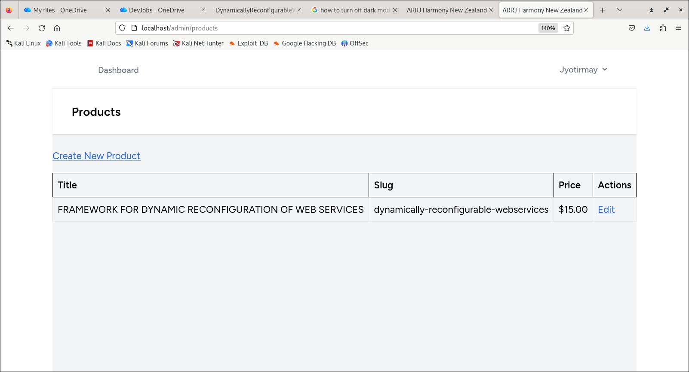
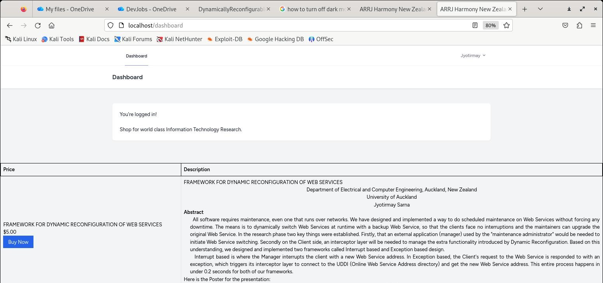
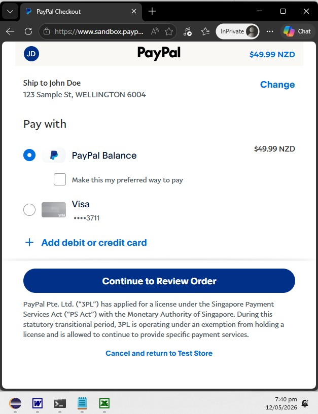
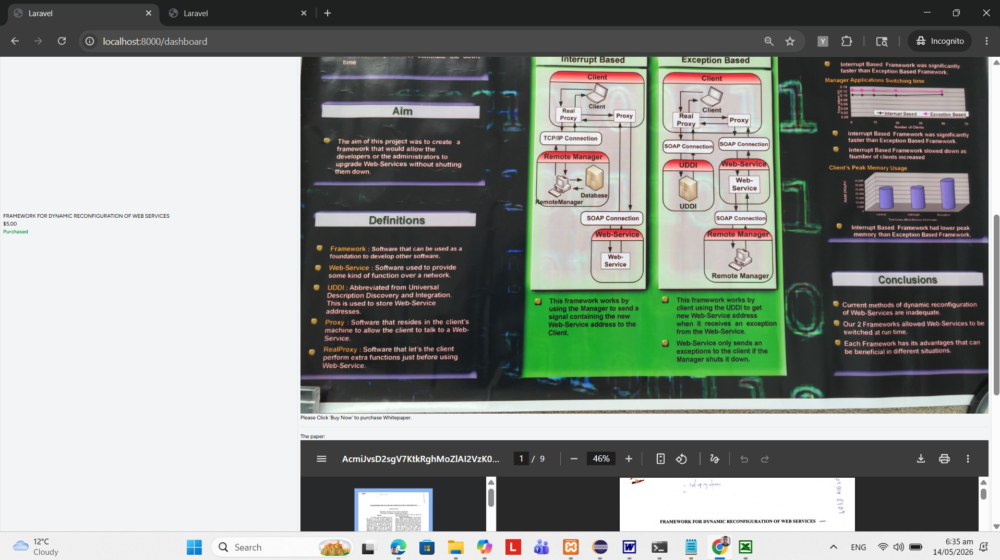

#WEBSTORE IMPLEMENTING 'CUSTOM CONTENT MANAGEMENT SYSTEM'- PHP LARAVEL BREEZE MYSQL STACK
#Dockerise application on Linux for testing
## 1.0 Summary
This Laravel application's Breeze components modularise and standardise pages, which feed and are fed via data at runtime from an internal database. The format and content of the pages is defined via a structure that together with Entity Relationship paradigm use for database access, forms the crux of the Content Management System. Boost was used to add AI capabilities to the project for help purposes. This knowledge article explains how to migrate development platform of such a 'CMS' laravel applicaiton, to use Laravel's Sail framework enabling the development team to take advantage of superior features of Containerisation. It involves firstly running an ansible script on the host linux vm which sets us the correct tools. Secondly, starting up the containers without using 'Sudo'. Thirdly migrating and seeding the database. Finally, this articles dwelves on the features of the underlying CMS application, i.e. secure runtime retrieval of data, which can be input and updated systematically. 

## 2.0 Administration

### 2.1 Change Log
Last updated 22 May 2026

### 2.2 Table of Contents
1.0 Summary
2.0 Administration
2.1 Change Log
2.2 Table of Contents
2.3 Table of Figures
3.0 Background
4.0 Assumptions
5.0 STEPS TO SETUP APP ON DOCKER
6.0 Create admin user and end user
7.0 Admin Uses CMS to create product
8.0 End user purchases Product
9.0 Conclusion
10.0 References

### 2.3 Table of Figures

<on its way>

## 3.0 Background
Flow is: ADMIN CREATES PRODUCT VIA ADMIN PAGE - ADMIN PAGE UNDER THE HOOD CREATES DATABASE RECORDS - END USER CONSUMES PAGE WITH SUCH RECORDS ON LOGIN - BEFORE PURCHASE, ONLY SUMMARY AVAILABLE - AFTER PURCHASE FULL TEXT OF DOCUMENT AVAILABLE.
## 4.0 Assumptions
Prior to starting with dockerisation, a basic level of functionality exists for the Laravel Applicaton, which has been confirmed as working (using XAMPP/LAMPP or other development PHP and MSQL tools).

## 5.0 STEPS TO SETUP APP ON DOCKER
1. Copy contents of project into a new folder.
2. If using Eclipse IDE, change the .project file to update project name, to match folder name.
3. Git init
4. git remote add origin https://<token-id>@github.com/Community-Love-Corp/webstore-jay.git

//increase repo buffer size as my repo is large. 
git config --global ssh.postBuffer 524288000

git pull origin main
git config pull.rebase false
git push origin main --force                  

composer require laravel:sail –dev
alias sail=’bash vendor/bin/sail’

//playbook to allow current user to be added to docker group, so docker can be run without sudo, and then run:

ansible-playbook –i “localhost,” –c local –become –ask-become-pass scripts/vm-setup-playbook.yml

php artisan sail:install //In the wizard, choose mySql, mailtip, mealisearch, redis and selenium

sail up –d -–build //- Creates docker-compose.yml. Creats Laravel container and the five others, three of which with volumes, and one networking container. Total of nine.

sail ps // verify outcome

//update .env file with following db details:
DB_CONNECTION=mysql
DB_HOST=mysql
DB_PORT=3306
DB_DATABASE=systematicdefence
DB_USERNAME=sail
DB_PASSWORD=password

//stop and start sail, so new environment values can take effect:
sail down -v
sail up -d

Time to create the database:
 
└─$ sail artisan migrate

   INFO  Preparing database.  

  Creating migration table ..................................................................... 33.22ms DONE

   INFO  Running migrations.  

  0001_01_01_000000_create_users_table ........................................................ 135.33ms DONE
  0001_01_01_000001_create_cache_table ........................................................ 100.70ms DONE
  0001_01_01_000002_create_jobs_table ......................................................... 117.89ms DONE
  2026_05_02_065328_create_comments_table ...................................................... 36.67ms DONE
  2026_05_08_103856_create_pages_table ......................................................... 48.22ms DONE
  2026_05_11_040138_create_orders_table ........................................................ 97.56ms DONE
  2026_05_13_064606_create_products_table ...................................................... 50.59ms DONE
  2026_05_13_113315_add_is_admin_to_users_table ................................................ 55.42ms DONE
  2026_05_13_181154_add_product_id_to_orders_table ............................................ 130.37ms DONE

 
Application should work now, if user navigates to http://localhost.

## 6.0 Create admin user and end user

### 6.1 Create two users via UI

1. nz_jay.sarna@outlook.com
2. developer.jay2@gmail.com

### 6.2 Use tinker to setup developer.jay2@gmail.com as the admin
//Pre-requisite - check mysql container exists
sail ps //you should see container by name webstore-jay-mysql1

// Make the developer user the admin
sail tinker
$user = App\Models\User::where('email', 'developer.jay2@gmail.com')->first();
$user->is_admin = true;
$user->save();

//verify
$user = App\Models\User::whereEmail('developer.jay2@gmail.com')->first();
$user->is_admin;

### 6.3 User Interface Verify
a. Admin user can see admin pages, and can see products page.
b. End user can see only products page.

## 7.0 Admin Uses CMS to create/edit product

Admin Portal

Product Edit Page

<i>Top</i>

<i>Bottom</i>

 
## 8.0 End user views Product available for purchase

In this custom CMS implementation, at runtime, data loads neatly from the database to populate products for sale. User can see only summary, with the option to buy now:

## 9.0 End user purchases Product

End User Clicks Buy Now:

Payment Successful leading to reveal of full text of research paper:

## 9.0 Conclusion
It is possible to migrate even complex applications to be used within Docker infrastructure for testing and pre-release verification purposes, where the containers can be created to mimic production like infrastructure in a repeatable/automated fashion, hence improving quality Assurance. 

## 10.0 Next Steps
Fully automated Staging/'Pre-Release' CICD pipeline on Azure Kubernetes infrastructure, using Terraform.