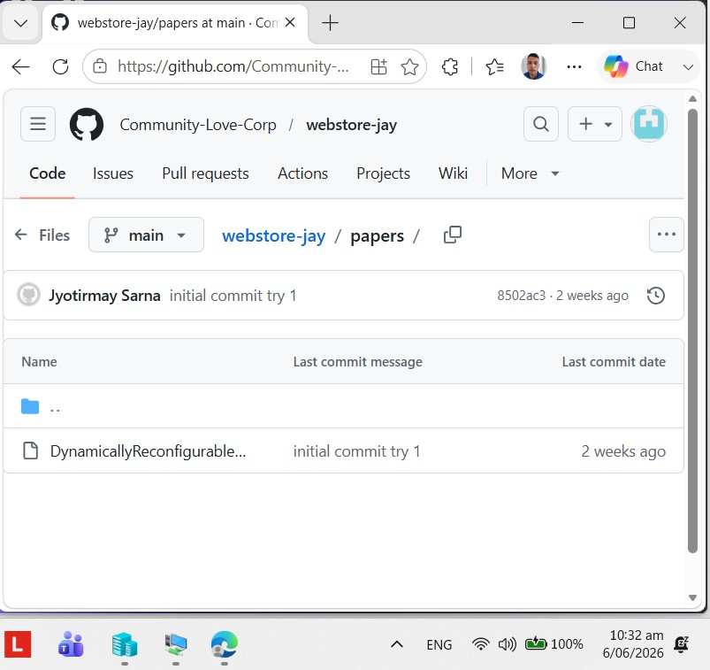

# Deployment

## 1.0 Summary

## 2.0 Administration

### 2.1 Change Log


| Version    | Date        | Author    | Description      |

|------------|-------------|-----------|------------------|

| 0.1        | 6 June 2026 | Sarna, J. | Initial Draft    |


### 2.2 Table of Contents

## 3.0 Background

After a git push deploys to production, two challenges:

3.1 How to manage switch over between production and local environment variables? 

3.2 How to automate that?

3.3 Best way to push local changes to github, so mistakes that require scrubbing can be eradicated?

## 4.0 CHALLENGE 1 - How to manage switch over between production and local environment variables?

### 4.1 Concepts

Laravel already behaves differently, based on what .env file's APP_ENV variable contains, i.e. if its value is 'local', it behaves like the app is running locally and if its value is 'production', it behaves like the app is running in production.

### 4.2 The correct pattern - Store variables in separate environment files 

#### 4.2.1 Local machine - .env 

APP_ENV=local 
APP_DEBUG=true 
APP_URL=http://localhost:8000 
 
DB_CONNECTION=mysql 
DB_HOST=127.0.0.1 
DB_PORT=3306 
DB_DATABASE=local_db 
DB_USERNAME=root 
DB_PASSWORD= 
 

#### 4.2.2 Production server → .env.production 

APP_ENV=production 
APP_DEBUG=false 
APP_URL=https://blog.systematicdefence.tech 
 
DB_CONNECTION=mysql 
DB_HOST=your-fastcomet-host 
DB_PORT=3306 
DB_DATABASE=prod_db 
DB_USERNAME=prod_user 
DB_PASSWORD=prod_pass 
 
### 4.2.3 How to tell fastcomet to use .env.production?

After pushing to FastComet, rename: 

.env.production -> .env 
 
Note: Laravel always loads .env — not .env.production.

## 5.0 CHALLENGE 2 - How to automate manage switch over between production and local environment variables in Production?

### 5.1 Create Automation script

Create file 'deploy.sh' in scripts folder:

```bash
#!/bin/bash 

  

echo "Starting deployment..." 

  

# 1. Upload latest code 

echo "Pulling latest code from Git..." 

git pull origin fastcomet 

  

# 2. Swap environment file 

echo "Updating environment file..." 

if [ -f .env.production ]; then 

    cp .env.production .env 

    echo ".env.production copied to .env" 

else 

    echo ".env.production not found!" 

    exit 1 

fi 

  

# 3. Clear Laravel caches using PHP 8.4 

PHP84="/opt/alt/php84/usr/bin/php" 

  

echo "Clearing Laravel caches..." 

$PHP84 artisan config:clear 

$PHP84 artisan cache:clear 

$PHP84 artisan route:clear 

$PHP84 artisan view:clear 

$PHP84 artisan optimize:clear 

  

# 4. Rebuild config cache 

echo "Rebuilding config cache..." 

$PHP84 artisan config:cache 

  

# 5. Recreate storage symlink 

echo "Ensuring storage symlink exists..." 

rm -f public/storage 

$PHP84 artisan storage:link 

  

echo "Deployment complete!" 
```
### 5.2 Setup script and run it

#### 5.2.1 Setup
When pushed into fastcomet, do following:

```bash
ssh systema1@s4710.syd1.stableserver.net
cd <project>/scripts
chmod +x deploy.sh
```

### 5.2.2 Run

```
./deploy.sh
```

## 6.0 CHALLENGE 3 - Best way to push local changes to github, so mistakes that require scrubbing can be eradicated?


### 6.1 Context - Mistakes

Sometimes, I pushed a .env file to Github, which leaked my credentials to Paypal business account, i.e anyone can steal my earnings. At other items, I pushed the very paper that I am selling to make my income, to github, so all can download it for free :(, as below:



### 6.2 Resolution - A 'STANDARD OPERATING PROCEDURE (SOP)'

#### 6.2.1 Pre-Req
a. In local repo 'webstore-jay' branch 'fastcomet' add in .gitignore files:

i. .env

ii. .env.*

iii. papers

iv. public/documents

v. storage/app/public/docs/

b. Explicitly untrack these folders

```bash
git rm -r --cached storage/app/public/docs
git rm -r --cached papers
git rm -r --cached public/documents
```
c. Verify folders no longer tracked

```bash
git ls-files | grep doc
```

#### 6.2.2 STEPS

a. In local repo 'webstore-jay' branch 'fastcomet', commit your changes.


b. Create new branch - fastcomet-github

```bash
git checkout -b fastcomet-github
```


c. Delete fastcomet branch in github. Also remove local fastcomet branch's connection to Github.

```bash
git remote remove origin 
```

d. Push local 'fastcomet-github' branch to Github to create branch 'fastcomet' there

```bash
git push origin fastcomet
```

e. Delete local 'fastcomet-github' branch

The benefit will be that the new 'fastcomet' branch in Github will have no history, and if I delete it, nothing is lost.


## 7.0 Conclusion
