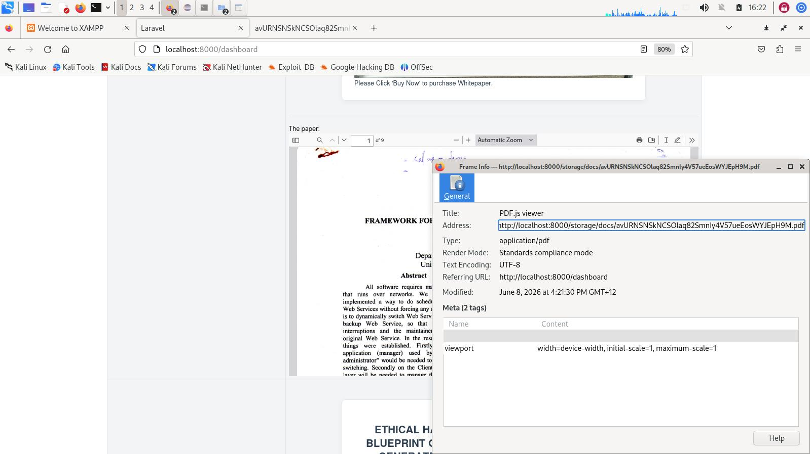
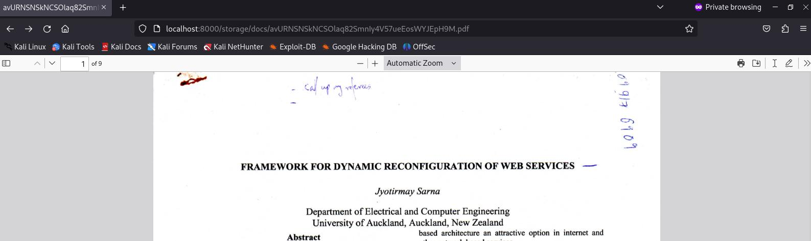
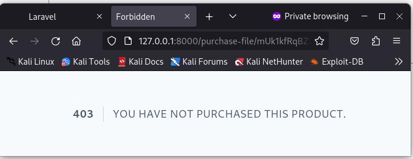

# Security Hardening

## Summary

## Administration

### Change Log

First Draft on 25 May 2026

| Version | Date         | Author    | Description    |
|---------|--------------|-----------|----------------|
| 0.1     | 25 May 2026  | Sarna, J. | Initial Draft  |
| 0.1     | 10 June 2026 | Sarna, J. | Fixed Broken Access Control - Directory Traversal Vulnerability


### Table of Contents

### Table of Figures

## Distributed Denial of Service (DDoS) protection

### Pre-req

- Register domain on google recaptcha site using admin credentials for a google account.

- Captcha only needed for external facing pages - forgot password, login and register

### Frontend code: /home/jyotirmay/webstore-jay/resources/views/auth/login.blade.php

All elements use the laravel 'old' format, so if catpha fails, their value can be returned. Further, a line is added just  before the submit button of the form, to identify the recaptcha site key. Finally, towards the end, the php code in Laravel notation produces php error if it is triggered, and the script is referenced.

Note: Even the checkbox's state is maintained, if the captcha fails. Only thing lost is the password.

```php
<x-guest-layout>
    <!-- Session Status -->
    <x-auth-session-status class="mb-4" :status="session('status')" />

    <form method="POST" action="{{ route('login') }}">
        @csrf

        <!-- Email Address -->
        <div>
            <x-input-label for="email" :value="__('Email')" />
            <x-text-input id="email" class="block mt-1 w-full" type="email" name="email" :value="old('email')" required autofocus autocomplete="username" />
            <x-input-error :messages="$errors->get('email')" class="mt-2" />
        </div>

        <!-- Password -->
        <div class="mt-4">
            <x-input-label for="password" :value="__('Password')" />

            <x-text-input id="password" class="block mt-1 w-full"
                            type="password"
                            name="password"
                            value="{{ old('password') }}" required autocomplete="current-password" />

            <x-input-error :messages="$errors->get('password')" class="mt-2" />
        </div>

        <!-- Remember Me -->
        <div class="block mt-4">
            <label for="remember_me" class="inline-flex items-center">
                <input id="remember_me" type="checkbox" name="remember" {{ old('remember') ? 'checked' : ""}} 
                class="rounded dark:bg-gray-900 border-gray-300 dark:border-gray-700 text-indigo-600 shadow-sm focus:ring-indigo-500 dark:focus:ring-indigo-600 dark:focus:ring-offset-gray-800">
                <!-- <span class="ms-2 text-sm text-gray-600 dark:text-gray-400">{{ __('Remember me') }}</span> -->
            </label>
        </div>

        <div class="flex items-center mt-4">
            @if (Route::has('password.request'))
                <a class="underline text-sm text-gray-600 dark:text-gray-400 hover:text-gray-900 dark:hover:text-gray-100 rounded-md focus:outline-none focus:ring-2 focus:ring-offset-2 focus:ring-indigo-500 dark:focus:ring-offset-gray-800" href="{{ route('password.request') }}">
                    {{ __('Forgot your password?') }}
                </a>
            @endif
        </div>
		    <br><br><p><div class="g-recaptcha" data-sitekey="{{ config('services.recaptcha.site') }}"></div></p>

            <p><x-primary-button class="ms-3">
                {{ __('Log in') }}
            </x-primary-button></p>

    </form>

    @if(session('captcha_error'))
        <p style="color:red;">{{ session('captcha_error') }}</p>
    @endif
    
    <script src="https://www.google.com/recaptcha/api.js" async defer></script>
</x-guest-layout>

```

### Backend code: /home/jyotirmay/webstore-jay/app/Http/Controllers/Auth/AuthenticatedSessionController.php

The store funtion firstly validates that all the required variables and recaptcha secret have arrived via the HTTP request. If so, then the secret is compared from the recaptcha api via internet connection. If, test passes, the program flow continues with authentication. If it fails, the flow is returned to originating page via the 'back' operation with error guidance:

```php
    public function store(LoginRequest $request): RedirectResponse
    {
        $request->validate([
            'email' => ['required', 'string', 'email'],
            'password' => ['required', 'string'],
            'g-recaptcha-response' => ['required'],
        ]);
        
        $captcha = $request->input('g-recaptcha-response');
        
        
        
        $verify = Http::asForm()->post('https://www.google.com/recaptcha/api/siteverify', [
            
            'secret' => config('services.recaptcha.secret'),
            
            'response' => $captcha,
            
        ]);
        
        
        
        if (!($verify->json()['success'] ?? false)) {
            
            return back()
            
            ->withInput()
            
            ->with('captcha_error', 'Please complete the CAPTCHA test.');
            
        }
          
        
        $request->authenticate();
		..
```

## Directory Traversal (OWASP A01:2021 - Broken Access Control)

### PROBLEM

#### URL



#### URL Exploited



### RESOLUTION

Basically, a new upload component was added in the higher priviledge user portal to handle purchase uploads. Details coming.

#### RESOLUTION OUTCOME




## Conclusion

## References
